# GUI - Graphical User or User Interface

1. A graphical user interface or GUI presents interactive visual components people can interact with on-screen to communicate with technology. For our consistency, we refer to as 'UI'

2. The information and how it is laid out, the icons, colors, text, shapes, and information that is all the UI. What happens when you tap or click something? That's the UI too.

3. Interfaces are about communication and since the dawn of time, humans have used tools as a means to communicate with each other. Cave drawings show us that people used sticks to illustrate stories and events.

4. The stick became the quill and the quill became the pen, which is still something used every day to convey messages and to communicate intent to others. Think of the modern keyboard, which is derived from the typewriter.

5. Humans interacted with a typewriter by hitting keys with their fingers to assemble words. You do the same thing today when you are posting a status update on your favorite social network.

6. Interfaces are also about tasks. Think about a car. The dashboard is a perfect example of a user interface.

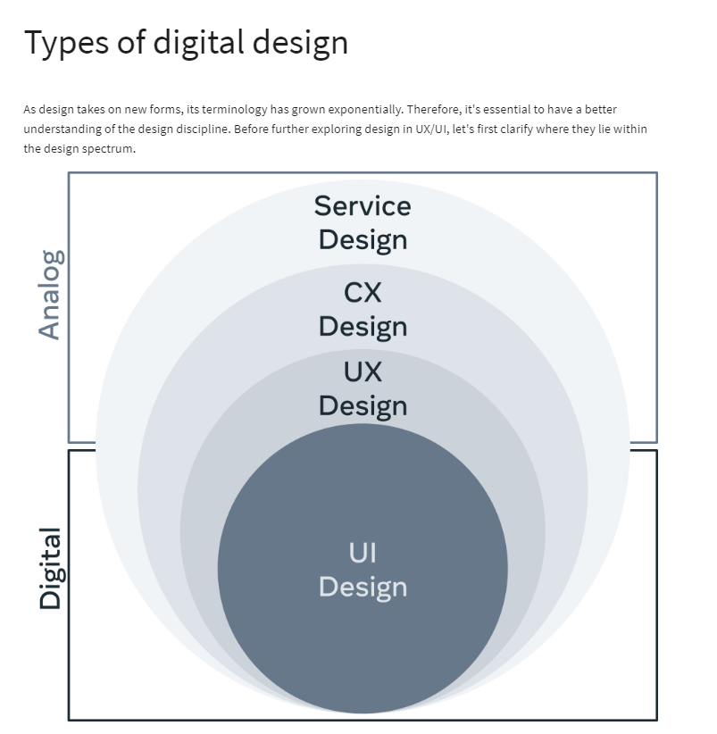
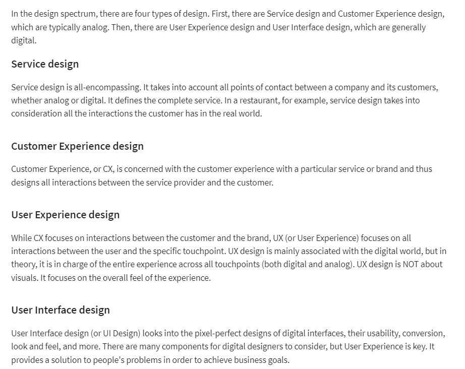
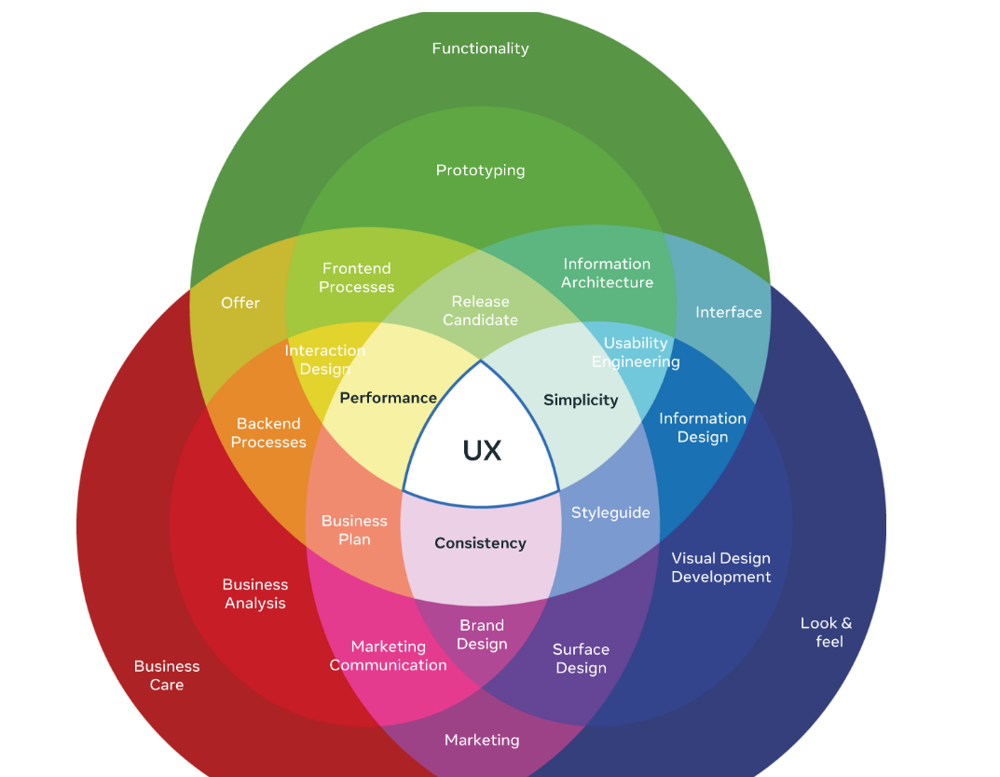
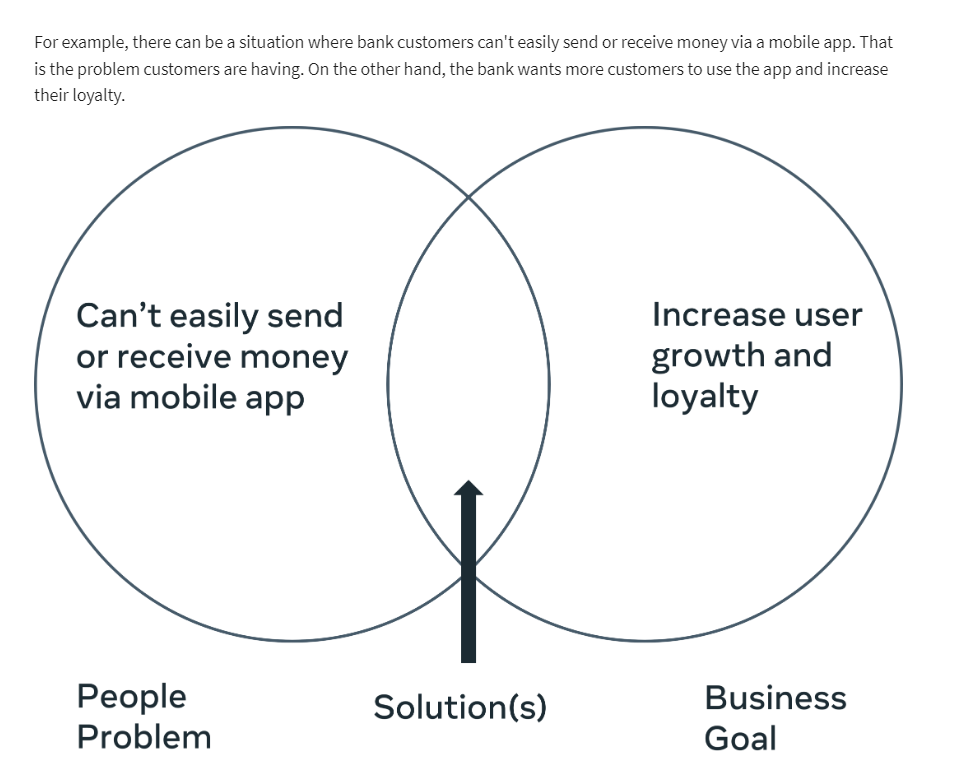
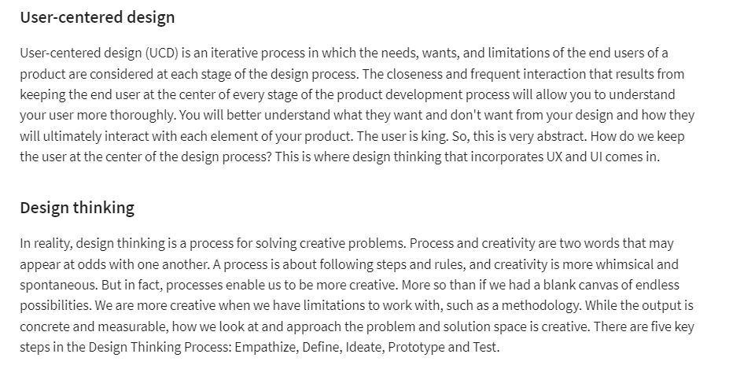
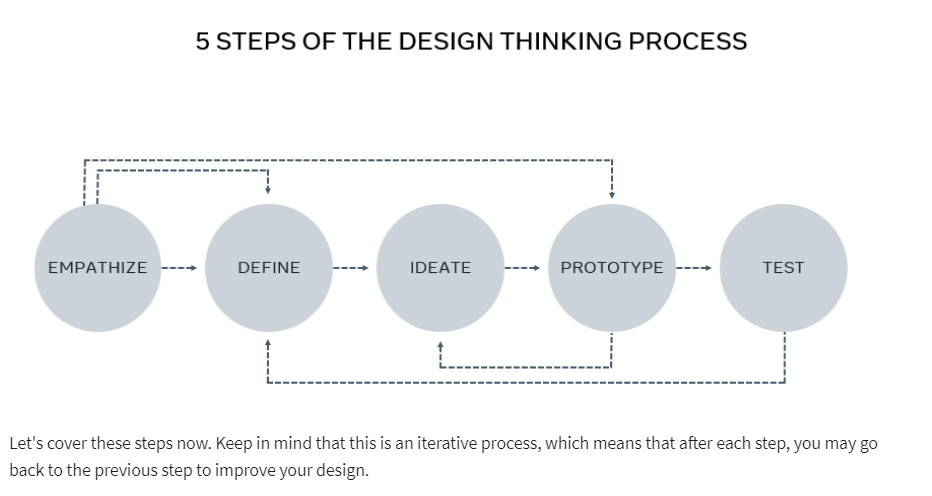
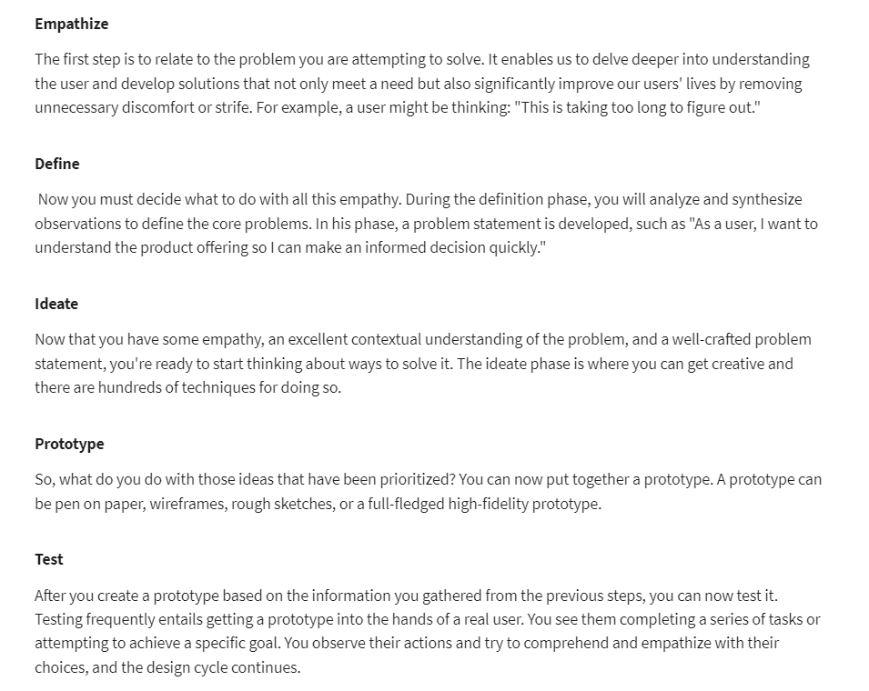

# Setup Figma Account

- Figma is a free web-based UX UI design prototyping tool

  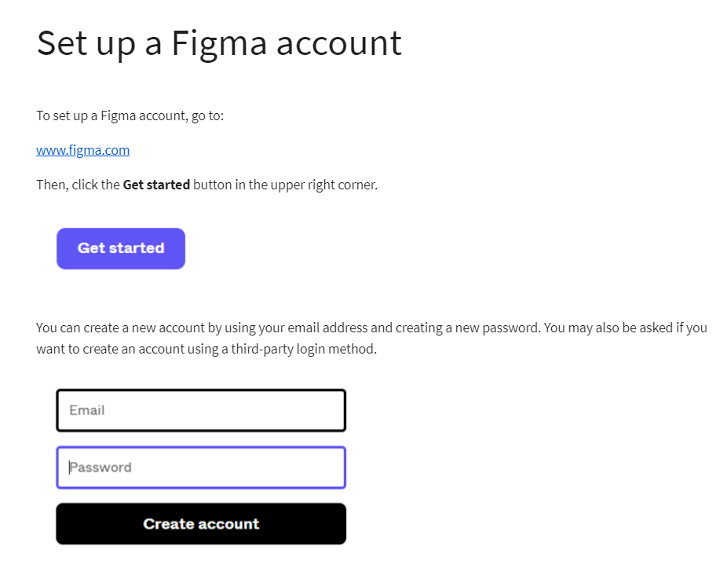
  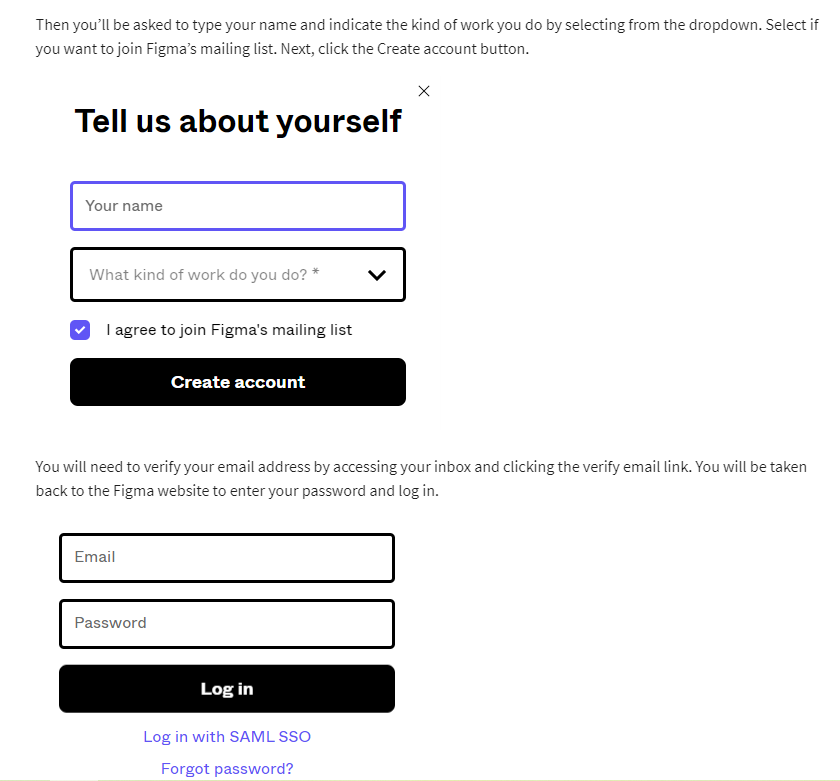
  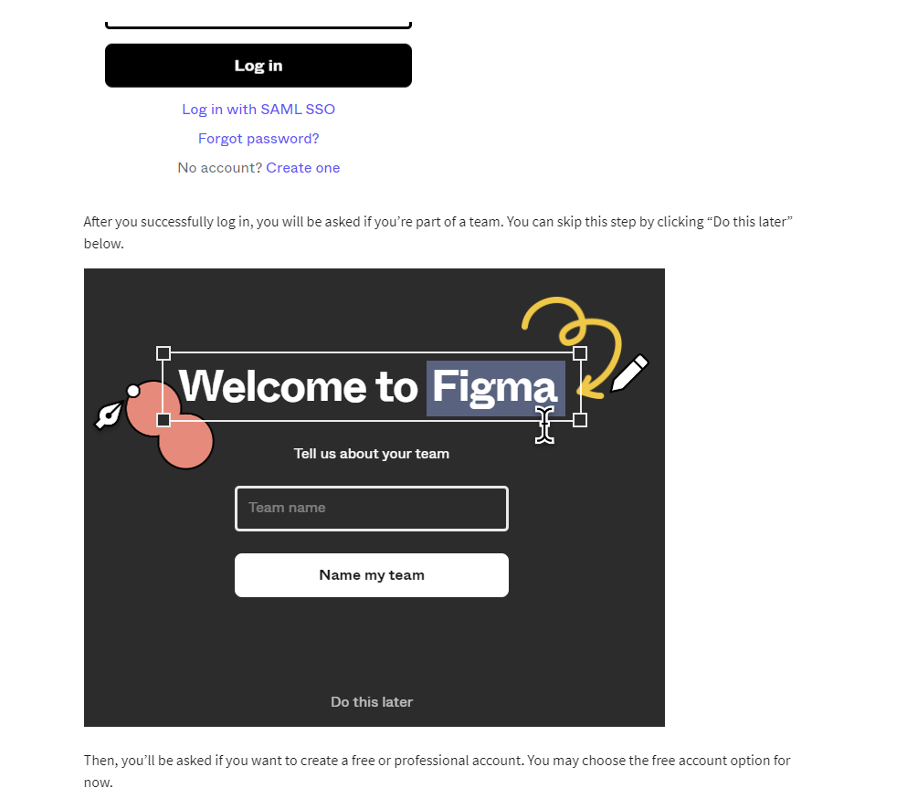
  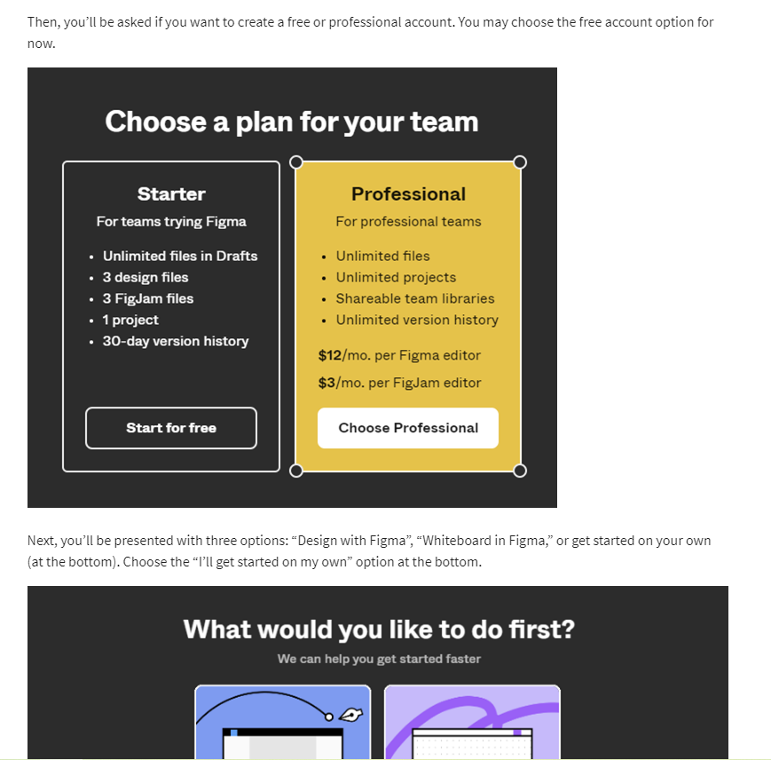
  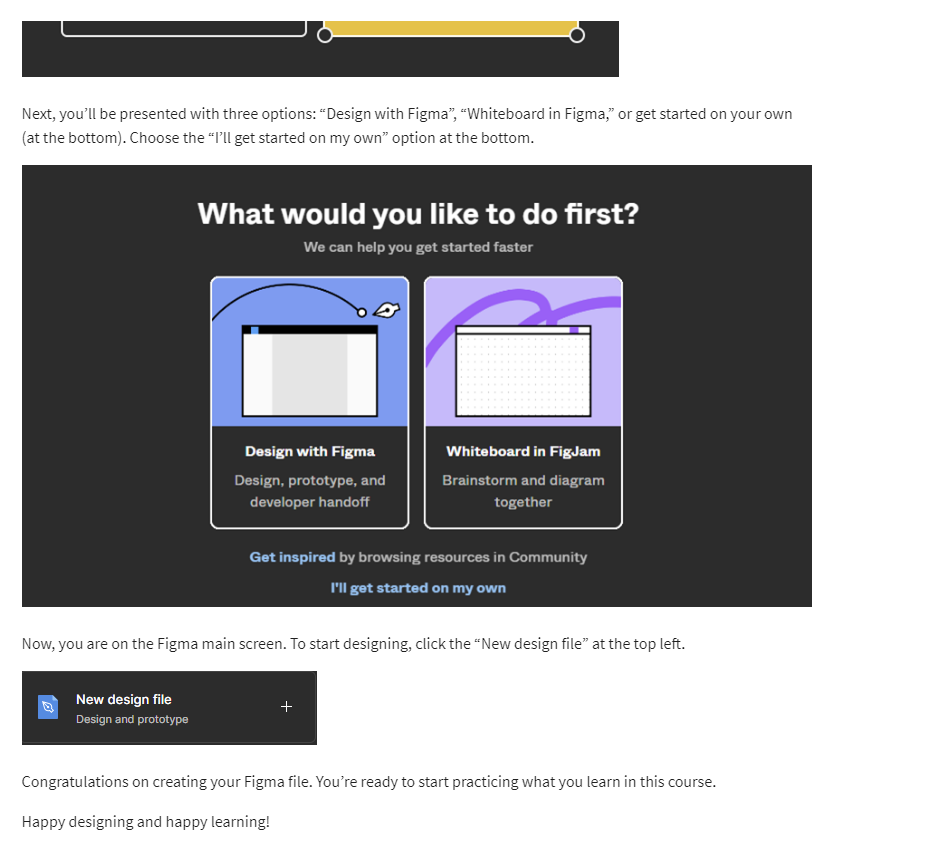

--> My figma , logged in with google account
--> First Design

- [https://www.figma.com/file/gEhHZQhMriNpyglNtDVadP/FirstDesignPractice?node-id=0%3A1&t=RzfPij526qDIc05h-0](https://www.figma.com/file/gEhHZQhMriNpyglNtDVadP/FirstDesignPractice?node-id=0%3A1&t=RzfPij526qDIc05h-0)

# Getting started with Figma

**Project : Designing for ordering a recipe from a 'litte lemon' website**

# Additional Resources

The following resources are additional reading materials that introduce you to UI design principles, digital design and how it differs from graphic design and the discipline of UI design. These will add to the knowledge that you’ve gained in this lesson.

**UI**
[UI design principles and tips for creating great UI][https://www.coursera.org/articles/ui-design]

[A comprehensive guide to the discipline of UI design][https://www.interaction-design.org/literature/topics/ui-design]

**User research**
[UI at its worst, an amusing but infuriating example of UI design .. Worth a look!][https://userinyerface.com/]

[A description on what Is UI Design][https://xd.adobe.com/ideas/process/ui-design/]
