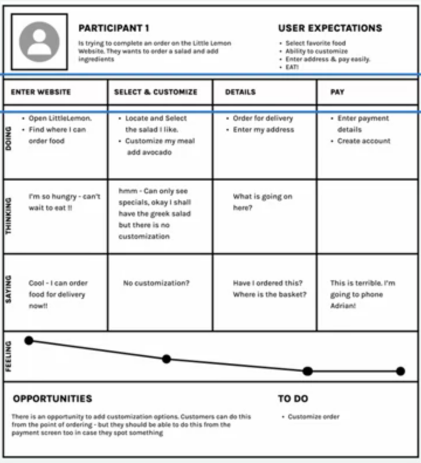
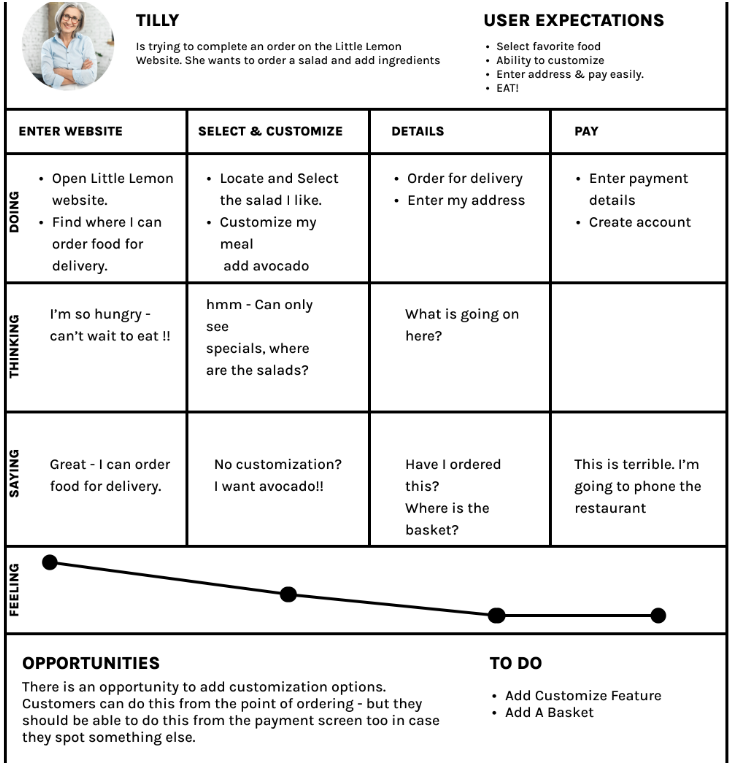
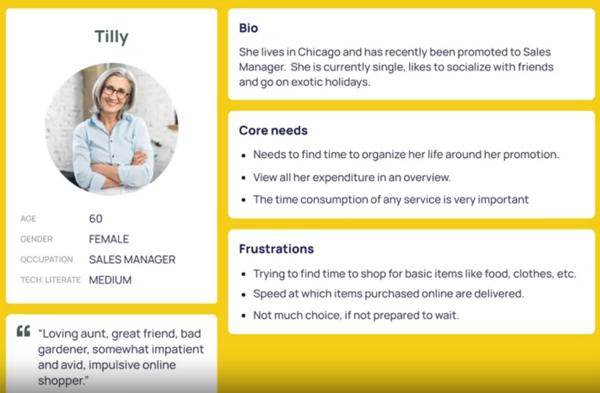
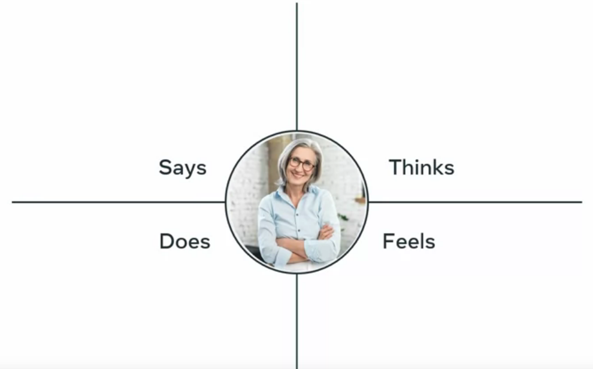

# Who is user?

- Information gathering is called 'USER RESEARCH'
- 'User Interviews' are the most important way to know about 'who the user is'?

## Examining the main issue that occured to customer while ordering a food using little lemon website.

- Difficulty in finding dishes as the menu button is not clearly identifiable
- Once discovered the menu item, the dropdown was not categorized properly w.r.t grouping.
- It was discovered that the basket was not visible. So user was not able to know regarding his addition of food
- unable to edit or update order.
- Unable to signup after filling all the details while ordering. They tried numerous times and they got validation error.

This has occured , because of no proper user research, so don't make assumptions

## Exploring the customer journey map :

- Keep in mind to keep record, of user interactions and reactions of users

- The customer enters the website and selects her meal. She wants to customize her order. She realizes she cannot. She abandons and picks up the phone to call Adrian.

- From the top-down of the customer journey map, you can list the customer's name, image, scenario and expectations. Next, you can list the steps she is trying to complete and track her thoughts and feelings, enter the website, select and customize her order at her details and pay.

- As she goes along, the journey map captures what she does, what she thinks, says, and what her feelings are while interacting with the website.

- In the end, you have a useful set of takeaways that can help you empathize with the user to improve on your redesign. In this example, you are presented with data from two user research methods, interviews and observations.

# Little Lemon Scenario

In this reading, you will learn how to present a scenario and a customer journey map documenting user requirements. You have already learned that scenarios define the stories and context that lead to a particular user or user group visiting your website. They help you make a list of the objectives and questions that need to be answered. Here are two Little Lemon scenarios.

**Scenario 1**
Tilly has come home from a long hard day at work. She is hungry, tired and low on groceries. She has been craving a healthy meal all day and decides to treat herself to a meal from Little Lemon, her favorite local restaurant.

**Customer journey**
A customer journey map is a graphical representation of how a customer interacts with your brand at various stages. These visuals tell a story about how a customer moves through and experiences each interaction phase. Touchpoints and moments of truth, as well as potential customer feelings, such as frustration or confusion, should be included in your customer journey map. You should also include any actions you want the customer to take.

Customer journey maps are frequently based on a timeline of events. For example, it starts with the moment the customer accesses the website. Then you document their progression when trying to achieve their goals, going anywhere from viewing the product or dish they want, its customization, signing up for the website, and even canceling an order. These are just some of the actions you may want to perform while using the website, but there could be many others.

The best **customer journey maps** are detailed and granular, and they help you understand the customer experience at every stage. Although there are different kinds of journey maps, they **typically share these five elements.**

- **1.Actor**
  The persona or user who goes on the journey is the actor. The journey map is about the actor — their point of view. Actors typically align with personas, and their actions on the map are data-driven. In the example you will explore below, Tilly is the actor.

To create a strong, clear narrative, you should provide one point of view per map: The Little Lemon in this instance. For example, you have Tilly as an actor and her journey while using the website. You create an individual map for each actor you have.

- **2.Scenario and expectations**
  The scenario describes the situation the journey map addresses and is associated with an actor's goal or need and specific expectations. For example, Tilly is ordering a meal online. And her expectation includes being able to easily find all the information required to make a decision and complete her order.

- **3.Journey phases**
  The journey phases are the various high-level stages of the journey. They organize the rest of the information in the journey map: actions, thoughts, and emotions. The phases will differ depending on the scenario.

- **4.Actions, attitudes and emotions**
  These are the actor's behaviors, thoughts, and feelings throughout the journey, mapped within each journey phase. Users' actions are their actual behaviors and steps. This part is not intended to be a detailed step-by-step list of each distinct interaction. Instead, it is a narrative of the actor's actions during that phase. At various stages, mindsets correspond to users' thoughts, questions, motivations, and the information they need. Ideally, these are direct quotes from customers.

- **5.Opportunities**
  Opportunities, along with additional contexts such as ownership and metrics, are mapping insights that inform how the user experience can be improved. Insights and opportunities assist the team in extracting knowledge from the map:

- What should be done with this information?

- Where can you find the best opportunities?

**CUSTOMER JOURNEY MAP**

**Final thoughts**
Journey mapping uncovers moments of frustration and delight in a series of interactions to provide a detailed view of the customer experience. When executed correctly, it reveals opportunities to address customer pain points, reduce fragmentation and improve the user experience.

# Empathy Tools

- Empathy tools: Empathy, Define, Ideate, Design, Test
- Creating 'user persona' based on interviews and observations
- User persona:
  --> Fictional character profile
  --> Represents the clientele
  --> Realistic model
- UX team can create multiple personas based on the size of the project and research results.
- In this case two user personas are created: 1) Typical retainable customer, 2)New customer
- Example of 'Tilly' Persona:
  
- **Empathy Map**
  
- **Scenario map** created for silly : help solve tilly's problems in the empathize stage.
- These tools help to create the following scenario. **Persona**: Tilly, goal; eat her favorite meal. **Want**: order a vegan penne carbonara for delivery. **Needs**: access the site, select and customize her order. **Resolution:** input her details, pay for, and track her order.
