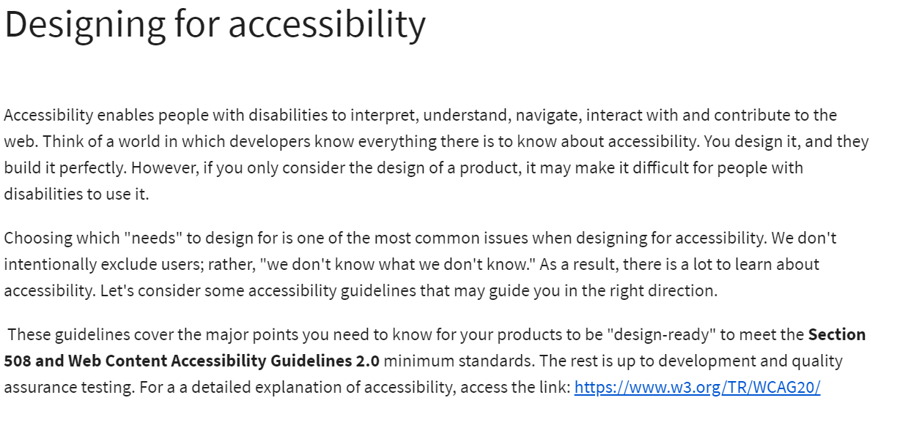
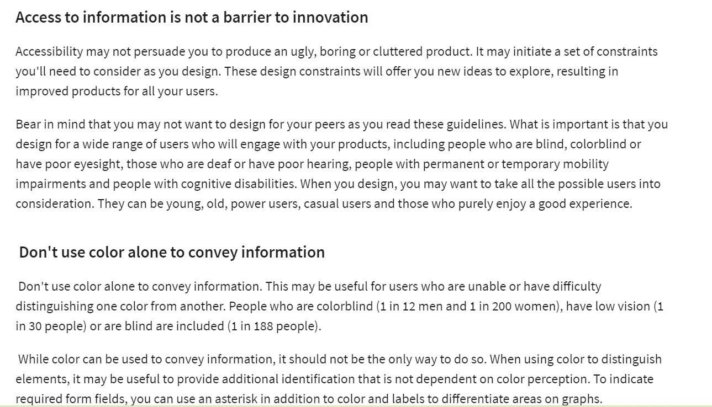
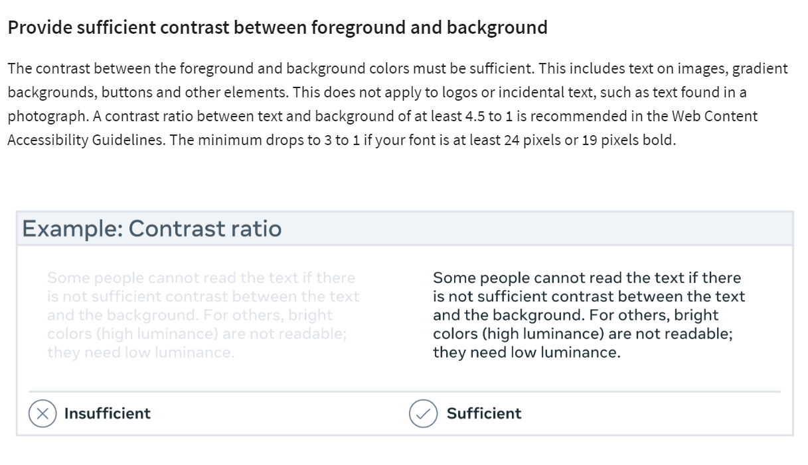
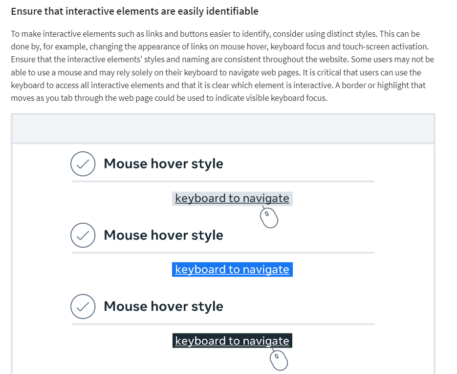
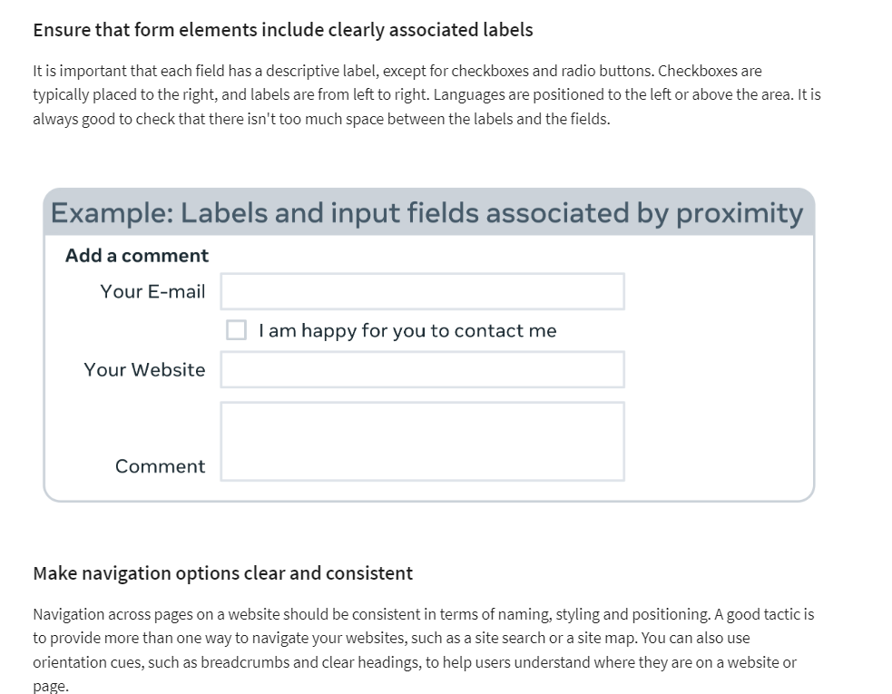
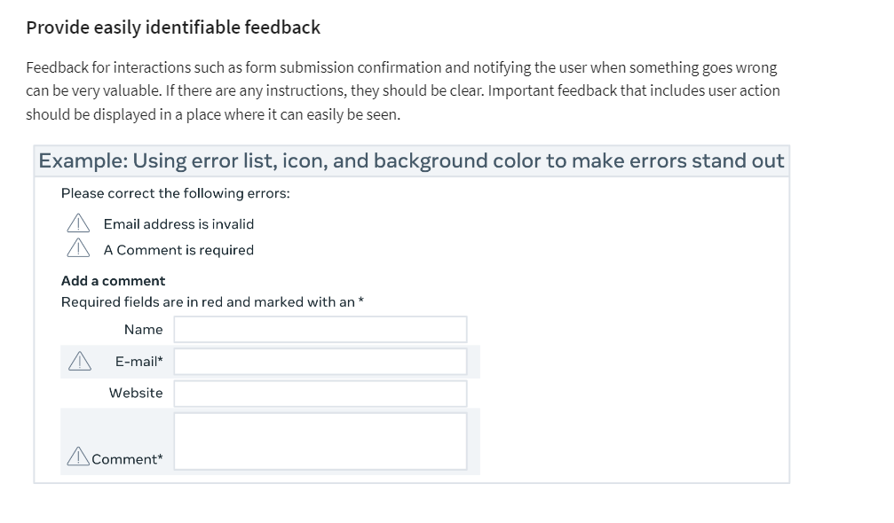
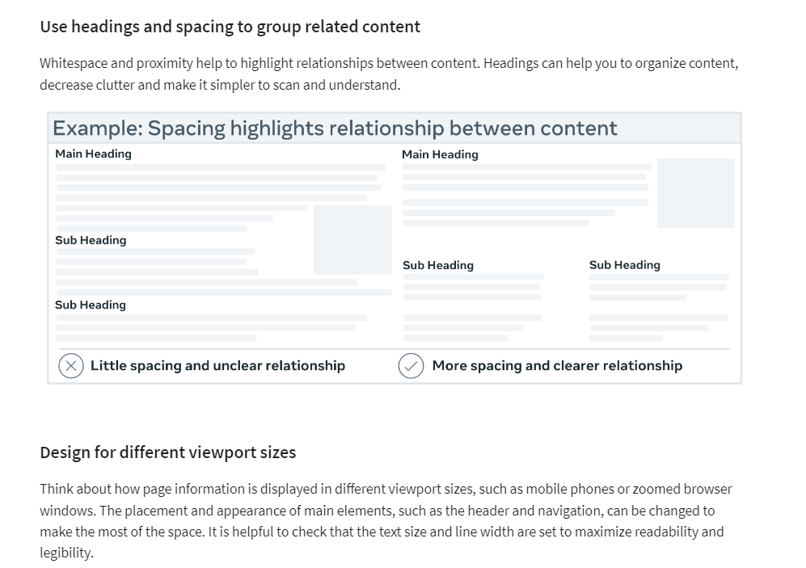
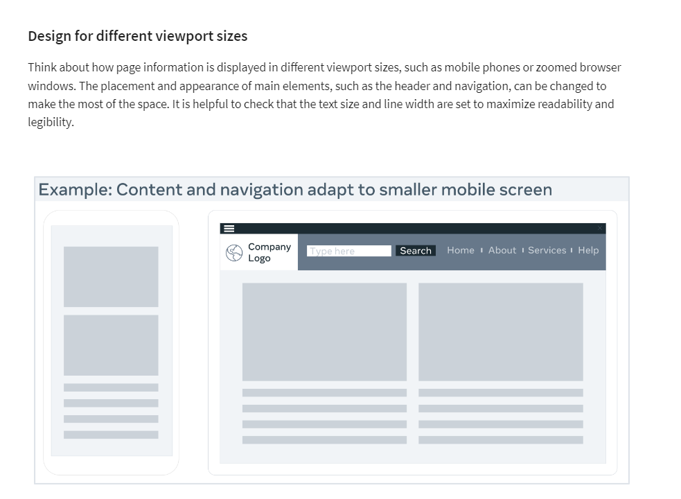
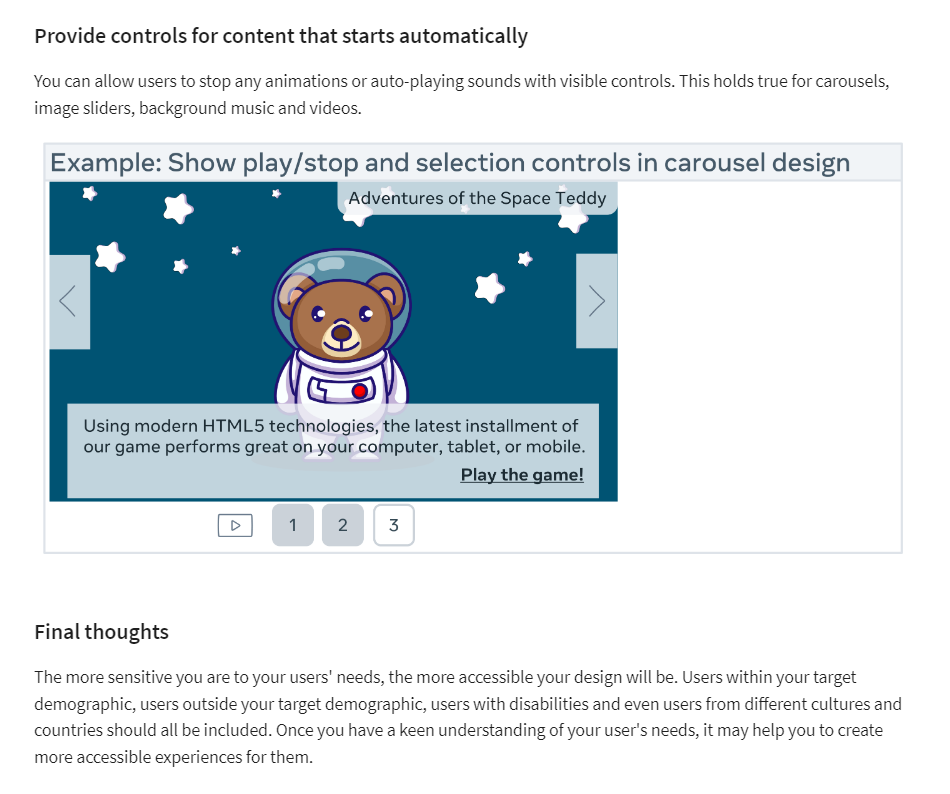

# Evaluation Methodologies

1. Dieter Rams
2. Jakob Nielsen
3. Schneiderman Evaluation

## Evaluating the design and Evaluation Cheet Sheets

### 1. "Dieter Rams" and his 10 “Good design” principles.

[https://www.youtube.com/watch?v=4Cxr2h_wE34](https://www.youtube.com/watch?v=4Cxr2h_wE34)

- The 10 Design Principple:

**Principle 1:** _Good design is innovative_

- "innovate" make changes in something established, especially by introducing new methods, ideas, or products.
- Whether you are making a change or doing something in a new way, developing new ideas or making improvements to existing designs and working alongside new technology, all of these offer a multitude of opportunities for you to be innovative within a design.

**Principle 2:** _Good design makes a product useful_

- good design emphasises the usefulness of a product
- It doesn't matter how stunning a product looks if it is practically unusable as it becomes completely worthless. Products are not pieces of art to be admired. They are there to serve a purpose and solve a problem.

**Principle 3:** _Good design is aesthetic_

- aesthetic: beautiful
- Beautiful items tend to make us feel comfortable. If a product is beautiful, you may be more inclined to use and want it. Some may argue against this point as you may have your own subjective idea of what is beautiful, and some well-designed items do prioritize utility over beauty. Regardless of your taste, you may like the things around you to be beautiful irrespective of how you define beauty.

**Principle 4:** _Good design makes a product understandable_

- understandable and intuitive
- For example, handles on doors that don't indicate if they should be pushed or pulled or taps which don't indicate if they are hot or cold just leave the user confused. The opposite of this is an instantly understandable product that is completely self-explanatory and communicates what it's about, what it's for and how to use it. This saves a user from breaking the product or spending time reading through instruction manuals.

**Principle 5 :** _Good design is unobtrusive_

- They are neither decorative objects nor works of art. Their design should therefore be both neutral and restrained, to leave room for the user's self-expression.
- An obtrusive product is an over-designed product. Products that tend to fail are those created with the designer in mind or with presumptions of who the user might be and or how they might use it. The very best products allow the user to do exactly what they want to do. These products should also help the user to complete their intended tasks effectively and happily. The design should not hinder the individual's intuitive process.

**Principle 6 :** _Good design is honest_

- Good design doesn't have tricks! It doesn't pretend to be something that it isn't, and it doesn't try to manipulate you into buying it by making promises that can't be kept. It should always have the user's best interests in mind, so it shouldn't have to try to lie to you or try to be something that it isn't.

**Principle 7** : _Good design is long-lasting_

- good design withstands the test of time
- Design should always be thorough to the last detail aand avoids being fashionable which means that it never appears old or antiquated.

**Principle 8**: _Good design is the thorough down to the last detail._

- A Good design should be detail-oriented and leave nothing to chance. Every single aspect of the design should be considered, and all the elements should qualify to be a part of that design. Products should be designed with care, thoroughness, and concern for the intended user.

**Principle 9**: _Good design is environmentally-friendly._

- Pollution can arise from wasted resources throughout a product's lifespan. Design shouldn't be wasteful and should save resources where it can, both physically and digitally.

**Principle 10**: _Good design is as little design as possible._

- Design should always be intentional. Anything that doesn't serve a purpose for the user should be excluded. With less clutter, a design will achieve more clarity for the user.

- follow the minimalism approach

### 2. Jakob Nielsen and his 10 “Good design” principles.

- [https://www.youtube.com/watch?v=6Bw0n6Jvwxk](https://www.youtube.com/watch?v=6Bw0n6Jvwxk) - Heuristic Evaluation of User Interfaces

- A heuristic evaluation is a usability inspection method for computer software that helps to identify usability problems in the user interface design. It specifically involves evaluators examining the interface and judging its compliance with recognized usability principles.

- Heuristics are a set of general principles used in interactive design to ensure usability and provide a relatively simple and quick testing regime to identify problems and possible solutions.

- 'Heuristic' means 'rule of thumb'

- **'10 Usablility Restricts'** [https://www.nngroup.com/articles/ten-usability-heuristics/](https://www.nngroup.com/articles/ten-usability-heuristics/)

**1. Heuristic #1 : Visibility of system status.**

- The design should always keep users informed about what is going on, through appropriate feedback within a reasonable amount of time.
- Explore your smartphone. Right after the screen lights up, it informs you about its battery and if you have a Wi-Fi connection, any received messages, missed calls and much more. Imagine how insecure you would feel if this information were missing. The system communicates its status and assists users in making better, more informed decisions by using signs, icons and indicators.

**2. Heuristic #2 : Match between system and the real world.**

- The design should speak the users' language. Use words, phrases, and concepts familiar to the user, rather than internal jargon. Follow real-world conventions, making information appear in a natural and logical order.
- Users may make assumptions about how a system will work based on their previous experiences with similar systems. You can help them overcome their initial discomfort by using language they are familiar with.

**3. Heuristic #3 : User control and freedom.**

- Users often perform actions by mistake. They need a clearly marked "emergency exit" to leave the unwanted action without having to go through an extended process.
- Digital spaces, like physical spaces, require quick "emergency exits." Users frequently select system functions by accident and need a clearly marked way to leave the unwanted position without going through an extended dialogue. So, support the undo and redo functions.

**4. Heuristic #4 : Consistency and standards.**

- Users should not have to wonder whether different words, situations, or actions mean the same thing. Follow platform and industry conventions.
- Consistency is the key. A "Submit" button on one page should look the same across the site on any page. If you show information in a particular format on one page, it should look the same on all pages.

**5. Heuristic #5 : Error prevention**

- Good error messages are important, but the best designs carefully prevent problems from occurring in the first place. Either eliminate error-prone conditions, or check for them and present users with a confirmation option before they commit to the action.
- A careful design that prevents a problem from occurring in the first place is even better than good error messages. Remove conditions that may cause errors in your design, or look for them and give your users a confirmation option so that they can make an informed decision before tapping or selecting anything.

**6. Heuristic #6 : Recognition rather than recall.**

- Minimize the user's memory load by making elements, actions, and options visible. The user should not have to remember information from one part of the interface to another. Information required to use the design (e.g. field labels or menu items) should be visible or easily retrievable when needed.
- Allow your users to recognize information in the user interface rather than expecting them to remember or recall it. Simply put, don't make your users work any harder than necessary! Make your navigation as clear, detailed and straightforward as possible. Offer them hints, remind them when something time-sensitive needs to be done and notify them when a screen or a process has been changed.

**7. Heuristic #7 : Flexibility and efficiency of use.**

- Shortcuts — hidden from novice users — may speed up the interaction for the expert user so that the design can cater to both inexperienced and experienced users. Allow users to tailor frequent actions.
- Simply put, your system must be designed so that both experienced and inexperienced users can use it. Think of designing a system in which a new user can find a way of performing a task without knowing any shortcuts. However, also design your system in such a way that an experienced user can use shortcuts to complete the action quickly and efficiently.

**8. Heuristic #8 : Aesthetic and minimalist design.**

- Interfaces should not contain information that is irrelevant or rarely needed. Every extra unit of information in an interface competes with the relevant units of information and diminishes their relative visibility.
- Make a fantastic first impression! Users notice aesthetics or how visually appealing your system is in the first 50 milliseconds of landing on a page, which is ten times faster than it takes them to read it. This means that you should make sure that you establish and reinforce your system's brand identity and credibility.

**9. Heuristic #9 : Help users recognize, diagnose, and recover from errors**

- Error messages should be expressed in plain language (no error codes), precisely indicate the problem, and constructively suggest a solution.
- A good error message should be polite, easy to understand, precise, constructive, clearly visible, and take as little time as possible to fix the problem as well as educate your users.

**10. Heuristic #10 : Help and documentation**

- It’s best if the system doesn’t need any additional explanation. However, it may be necessary to provide documentation to help users understand how to complete their tasks.
- Even though it is preferable that your system can be used without documentation. It is important that any such information should be: easy to find, focused on the user's task, include the actual steps they should take, and not be too large.

### 3. Schneiderman Evaluation : 8 Golden rules of interface design.

**Rule 1: Strive for consistency**
Consistency is critical to maintaining uniformity throughout the site, whether it's the layout, the size of the button, the color code, or the tone used when writing the page. Consistency will enable you to establish your identity and stop users from abandoning your site.

**Rule 2:Enable frequent users to use shortcuts**
Think about allowing your users to access all areas of your website with a few clicks. To accomplish this, you should create a good hierarchy in the menu and make things clear. Consider including features for both advanced and novice users, such as keyboard shortcuts or macro-capabilities.

**Rule 3:Offer informative feedback**
If your users have completed or are completing activities on your website, it is best to provide feedback as soon as possible so that they can understand where they are in the system.

**Rule 4:Design dialog to yield closure**
All interactions must have a beginning, middle and end. Once a task is completed, maybe give your users some peace of mind by providing them with informative feedback and well-defined choices for the next step, if applicable. Don't keep them guessing!

**Rule 5:Offer simple error handling**
An interface should be designed to eliminate as many errors as possible. If something goes wrong, the system should make it simple for users to understand and resolve the problem. A good idea is to display clear error notifications and descriptive hints to resolve the problem. These are examples of simple ways to deal with system errors.

**Rule 6:Permit easy reversal of actions**
Finding that there is an "undo" option after making a mistake is a huge relief. Your users should feel less anxious and more likely to explore options if they know there is a simple way to undo any mistakes. This rule applies to any action, sequence of steps or data entry in your system. This can range from a single button to a complete set of actions.

**Rule 7:Support internal locus of control**
It is essential to give your users control and freedom so that they feel in control of the system instead of the other way around. As the designer, try to avoid surprises, interruptions and anything that the users didn't request. Users should be the ones who initiate actions.

**Rule 8:Reduce short-term memory load**
As users, our attention span may be limited, so anything you can do to make your users' jobs easier is a win-win situation. Your users may prefer to recognize information rather than recall it. Try to keep interfaces simple and consistent and keep to patterns, standards and conventions. This may contribute to better recognition and ease of use. Depending on your users' objectives, you can add various features to help them. In an e-commerce setting, for example, a list of recently viewed or purchased items can be presented.

## Designing for Accessability

## Case Study: Accessibility at Meta

## Exercise: Heuristic Evaluation

**Overview**
In this exercise, you will carry out an abridged version of a heuristic evaluation using Jakob Nielsen’s 10 Usability Heuristics for User Interface Design. The attached template is a guide that will assist you in determining how user-friendly the site is. You can choose any website you wish to evaluate.

The goal of this template is not to provide you with a specific diagnosis for the website you choose to evaluate but to assist you in identifying areas to focus on to improve the user experience.

Simply put, the goal is to help you identify problems with the site that may make it difficult for users to find information, complete tasks and effectively use the site.

**Step 1**
Open the Excel sheet called “Heuristics Template.” Click on Template 1 at the bottom of the Excel sheet. In template 1, all the heuristics are listed with its relevant definition. Start by selecting the usability problems under the relevant heuristics it violates. Then assign a severity rating of none, cosmetic, minor, major or catastrophic to each problem.

_Severity Ratings_
_S0:_ It violates a heuristic but does not appear to be a usability issue.

_S1:_ Users may easily overcome cosmetic usability issues or occur infrequently. Unless extra time is available, it does not need to be fixed for the next release.

*S2: *Minor usability problems may occur more frequently or be more challenging to overcome. Fixing this should be given low priority for the next release.

_S3:_ Major usability problem occurs frequently and persistently or users may be unable or unaware of how to fix the problem. It is essential to fix, so it should be given high priority.

_S4:_ Usability catastrophe seriously impairs the use of the product and cannot be overcome by users. It is imperative to fix this before the product can be released.

**Step 2**
Click on Template 2 at the bottom of the Excel sheet. All the heuristics are mentioned and what each means in template 2. Describe the problem you encounter and assign an easy to fix rating to each problem, which is maximum, considerable, concentrated, easy or trivial.

**Easy to Fix Rating:**
_E0:_ Fix will require maximum effort, including more investigation into the proper solution.

_E1:_ Fix will require considerable effort, but the issue and solution are understood.

_E2:_ Fix will require a more concentrated effort, but the issue and solution are understood.

_E3:_ A single developer with minor effort can quickly complete Fix.

_E4:_ Fix is trivial and easy to implement.

## Solution: Heuristic evaluation

The solution provided is a full heuristics report, which follows the above-abridged exercise. However, it contains a lot more information that will be helpful if required to undertake a full heuristics evaluation.

## Additional Resources

The following resources are additional reading materials that introduce you to designing for accessibility, usability, Dieter Ram’s 10 Good Design principles, Ben Schneiderman’s 8 Golden rules and Jakob Nielsen’s heuristic evaluation method. These will add to the knowledge that you’ve gained in this lesson.

**Design tips & methods**

Designing for Accessibility top tips to get you started
[https://www.w3.org/WAI/tips/designing/](https://www.w3.org/WAI/tips/designing/)

Designing for Accessibility top tips to get you started
[https://www.interaction-design.org/literature/topics/accessibility](https://www.interaction-design.org/literature/topics/accessibility)

Good tips to help Improve any Online Form
[https://uxplanet.org/the-18-must-do-principles-in-the-form-design-fe89d0127c92](https://uxplanet.org/the-18-must-do-principles-in-the-form-design-fe89d0127c92)

Usability methods
[https://www.usability.gov/how-to-and-tools/methods/usability-evaluation/index.html](https://www.usability.gov/how-to-and-tools/methods/usability-evaluation/index.html)

Component design and ways of using them
[https://wereheavyweight.medium.com/how-were-using-component-based-design-5f9e3176babb](https://wereheavyweight.medium.com/how-were-using-component-based-design-5f9e3176babb)

An article on form design and best principles
[https://xd.adobe.com/ideas/principles/web-design/best-practices-form-design/](https://xd.adobe.com/ideas/principles/web-design/best-practices-form-design/)

Design systems explained in detail
[https://www.nngroup.com/articles/design-systems-101/](https://www.nngroup.com/articles/design-systems-101/)

Current inspirational design systems
[https://uxplanet.org/10-most-popular-design-systems-to-learn-from-in-2022-for-ux-designers-18a24843a860](https://uxplanet.org/10-most-popular-design-systems-to-learn-from-in-2022-for-ux-designers-18a24843a860)

**User research**

Dieter Ram
[https://designmuseum.org/discover-design/all-stories/what-is-good-design-a-quick-look-at-dieter-rams-ten-principles](https://designmuseum.org/discover-design/all-stories/what-is-good-design-a-quick-look-at-dieter-rams-ten-principles)

Ben Schneiderman
[https://www.interaction-design.org/literature/article/shneiderman-s-eight-golden-rules-will-help-you-design-better-interfaces](https://www.interaction-design.org/literature/article/shneiderman-s-eight-golden-rules-will-help-you-design-better-interfaces)

Jakob Nielsen describes his heuristic evaluation method design using ten well-proven general principles for human-computer interaction
[https://www.youtube.com/watch?v=6Bw0n6Jvwxk](https://www.youtube.com/watch?v=6Bw0n6Jvwxk)
