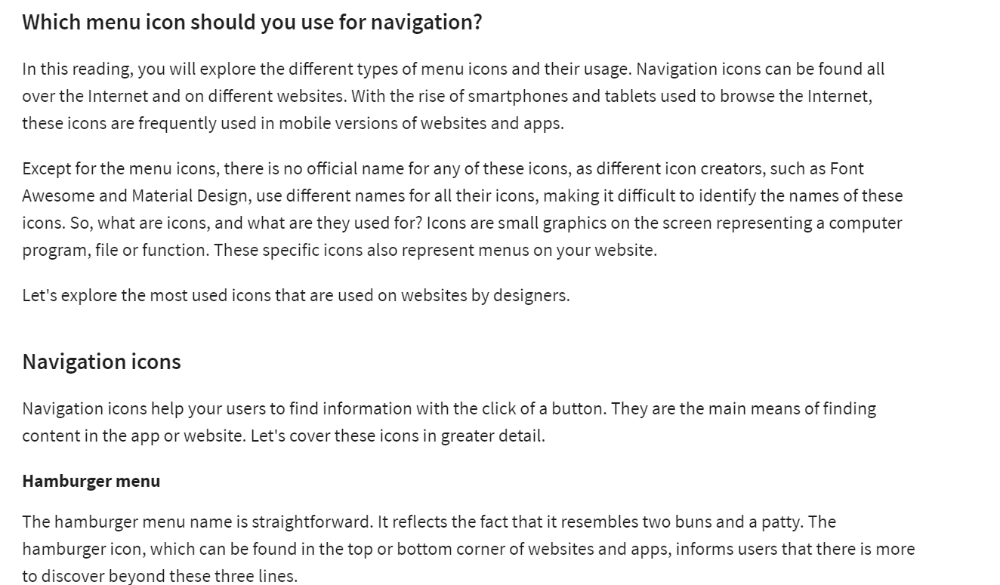
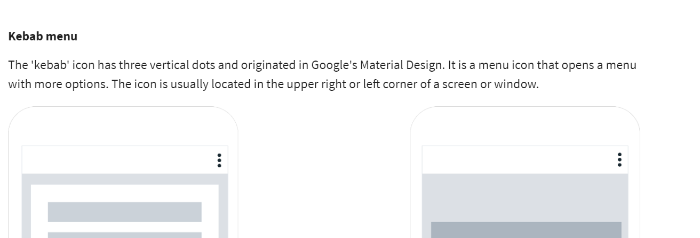
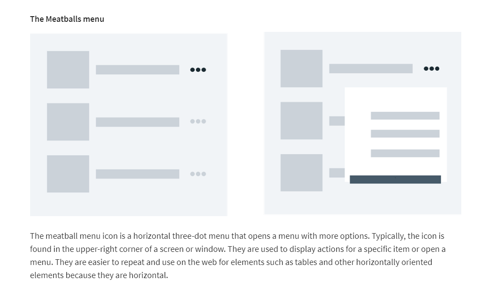
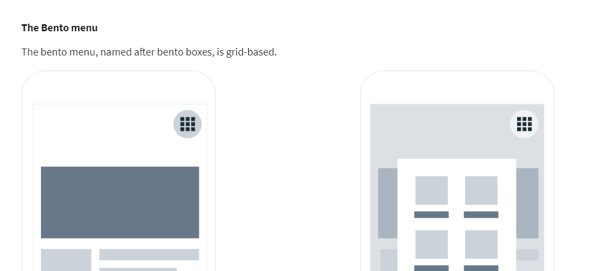
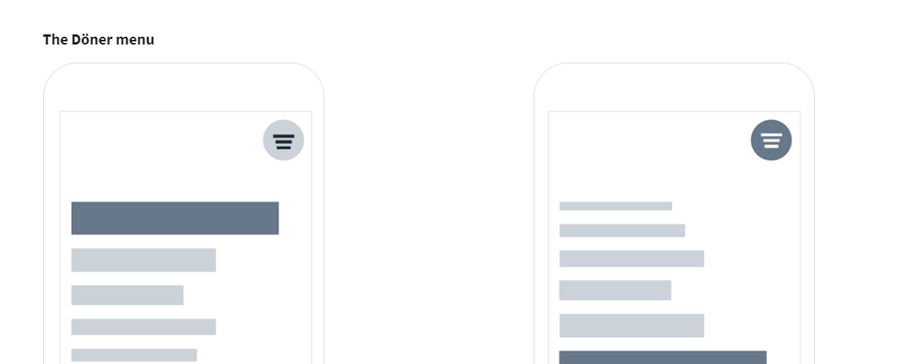
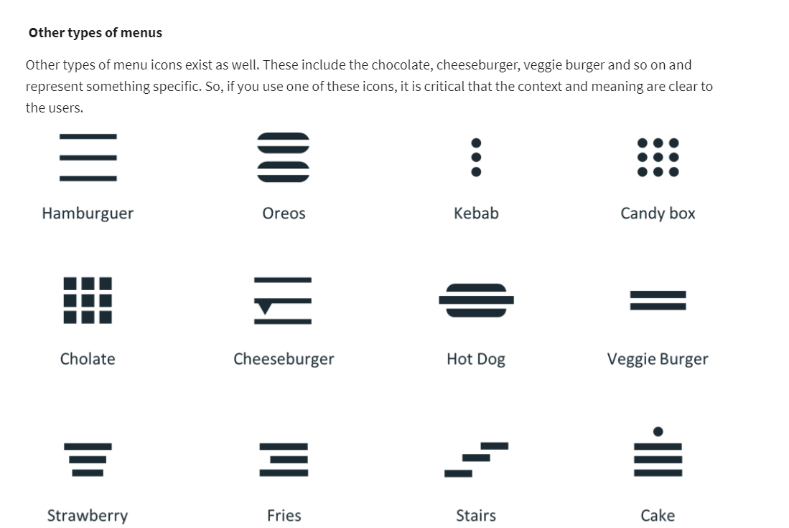

# Use of Menu Icons in Navigation

- 'Content Design' involves presenting the content on your website in a meaningful way that will promote your products. It helps to align your client’s business and UX goals and it also assists in aligning your content around your personas and scenarios.

# Additional Resources

The following resources are additional reading materials that introduce you to navigation menu icons, best practices for designing navigation, icon design principles, usability and evaluating interactive design. These will add to the knowledge that you've gained in this lesson.

**User research**

[Navigation menu icons : some nice examples](https://www.awwwards.com/31-examples-of-icons-in-navegation-menus.html)

[Principles of Icon Design](https://uxdesign.cc/7-principles-of-icon-design-e7187539e4a2?gi=69ad499aaa39)

[Usability Evaluation](https://www.interaction-design.org/literature/book/the-encyclopedia-of-human-computer-interaction-2nd-ed/usability-evaluation)

[Evaluating interactive design](https://gayan1999malinda.medium.com/interaction-design-evaluation-methods-df8132cedbf9)
