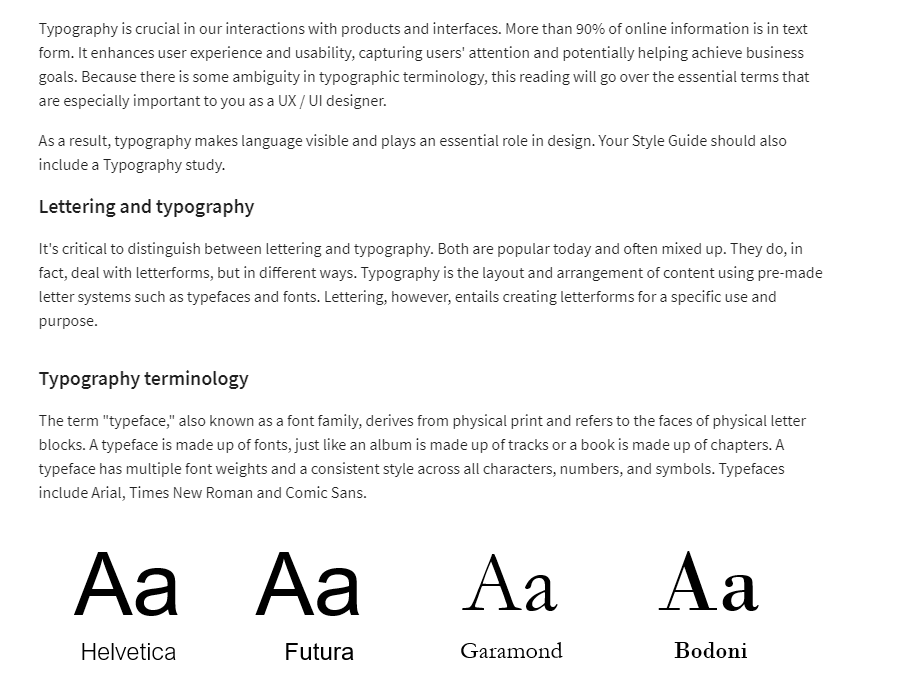
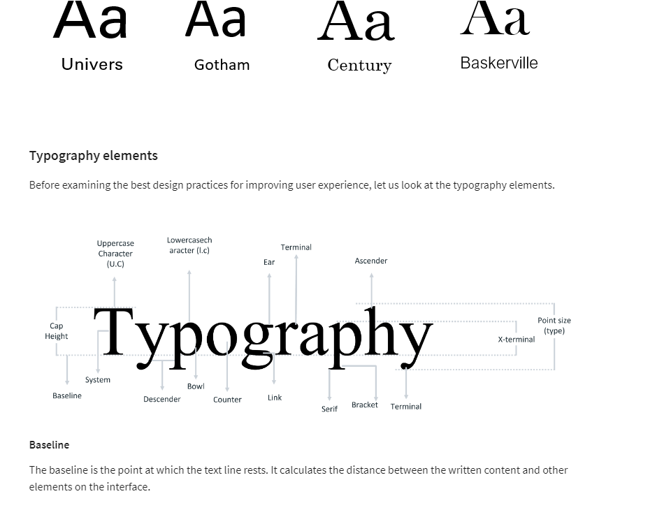
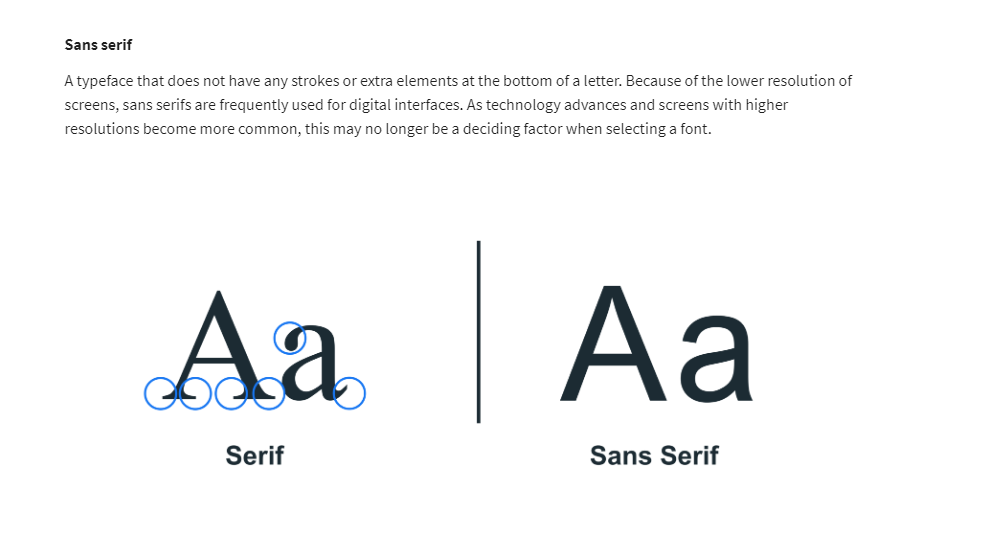
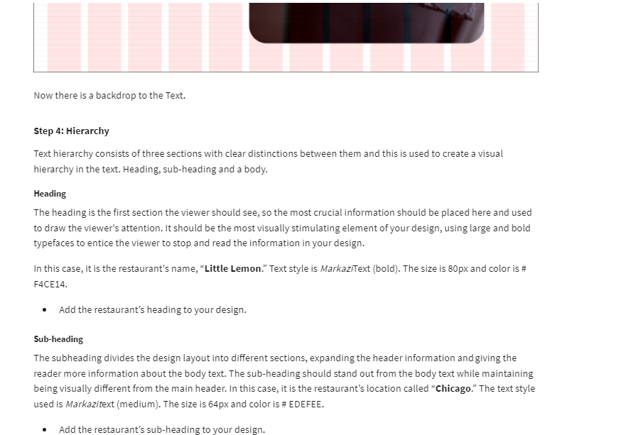
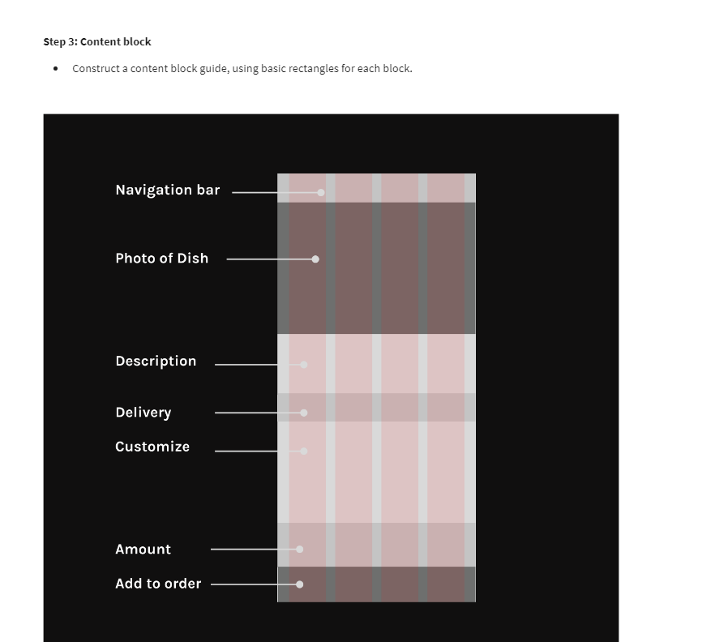
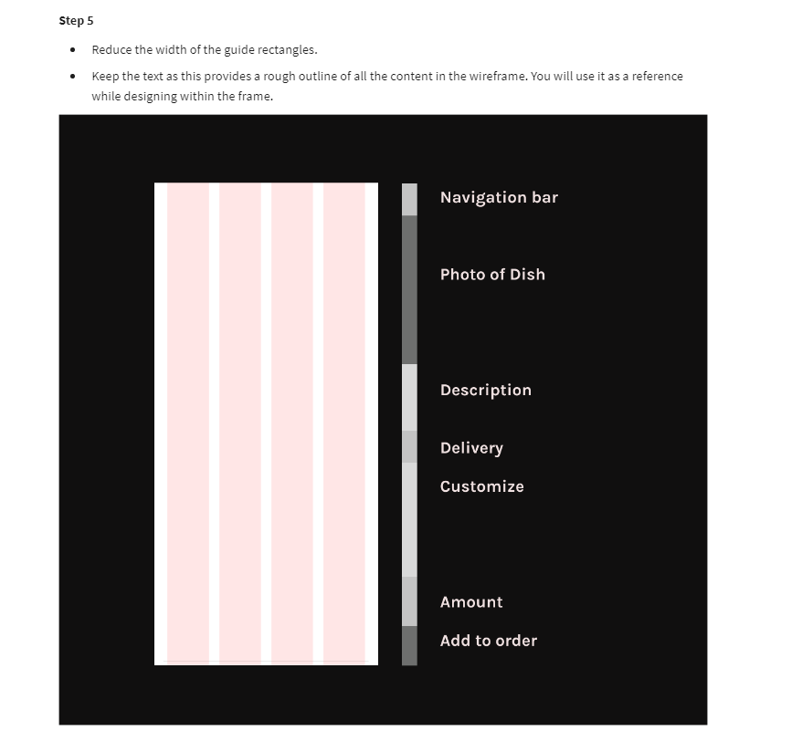

# Figma Fundamentals

## Frames, Layers andBasic Shapes | Make Video On Figma- Intro to tool

- **Frames** : Also referred to as an artboard.
- **Layer**: An object within a frame.
- **Group**: Multiple objects combined

## Type and Text | Make Video On Figma- Type and Text

## Typography and Best practice

## Grids and Constraints Make Video On Figma- Grids and Layout

- Responsive Design
- Ctrl + shift + 4 to toggle grids
- Grids organize the content on the page and create alignment and order.

## Creating grids for tablets and mobile

## Grid Systems

## Manipulating Elements - Boolean Opearations, Design with align Elements, Scaling an Object| Make video of Manipulating Elements

**1. Boolean Opearations**

- Union Selection
- Extract Selection
- Intersection Selection
- Subtract Selection

  **2. Design with align Elements**

- When working with multiple elements, it’s important to make sure they align precisely. You can achieve that by using the Design panel in the right sidebar.
- Proper alignment is important in a design. You can align objects by using the tools in the design panel in the right sidebar.

  **3. Scaling an Object- Resizing an Object**
  

Problems Faced:
[https://www.reddit.com/r/FigmaDesign/comments/gkynph/dont_see_boolean_tool/](https://www.reddit.com/r/FigmaDesign/comments/gkynph/dont_see_boolean_tool/)

[https://imgur.com/a/womCcia](https://imgur.com/a/womCcia)

[https://discourse.mcneel.com/t/boolean-union-failure-is-there-way-to-detect-where-solved-in-v6/48037](https://discourse.mcneel.com/t/boolean-union-failure-is-there-way-to-detect-where-solved-in-v6/48037)

## Working With Images |Make Video On Inserting Images, Masking Elements

- To create a mask in Figma, first you select the shape and the image. Then, you make sure that the image is on top of the shape. You can do that in the layers panel in the left sidebar.

## How to save and import Figma files

## Exercise: Design- Text Hierarchy and Grid

- Margins are the negative space between the outside column’s edge and the frame. The gutter is the negative space between columns.

- Every web page is made up of squares and rectangles. They are located within an encompassing grid layout.

- Baseline grids set the leading from one line of text to the next for consistency. These are easier to organize, create vertical rhythm, and are aesthetically pleasing. As you probably used at school, a sheet of ruled paper is an example of a baseline grid.

- The frame is a container where your design lives.

- Responsive design is an approach to web page creation that uses flexible layouts, removing the need to design layouts to suit every device.

## Additional Resources

The following resources are additional reading materials that introduce you to grid systems, how to use grids to improve hierarchy and 10 Principles for typography in UI design. These will add to the knowledge that you’ve gained in this lesson.

**Grids and constraints**

- [Video on grids and constraints](https://www.youtube.com/watch?v=BsR9dKfkNuA)

- [How to use grids to improve visual hierarchy](https://uxplanet.org/how-i-use-grids-to-improve-visual-hierarchy-18af5214e8a1)

**Typography**

- [10 Principles for Typography in UI Design: Typography in Design Systems](https://uxdesign.cc/10-principles-for-typography-usage-in-ui-design-a8f038f43ffd)

- [Typography and best practice](https://medium.com/eightshapes-llc/typography-in-design-systems-6ed771432f1e)

\*Consider reading Robert Bringhurst’s book called "The Elements of Typographic Style" if you want to learn more about typography.

# Wireframing

- The purpose of a wireframe is to create a basic structure for each screen in the design before things like branding, colors and images are considered. It provides a way of communicating ideas quickly, which can be refined later. You focus on the user experience and on what they need to accomplish a task.

## Rapid Prototyping

- In this reading, you will learn about rapid prototyping, its advantages, its cycle and the levels of fidelity you can use. Before investing time and money in developing an idea and creating a product, you should make sure it works as intended. You should test it to ensure that it is user-friendly and free of bugs and that it assists the user in carrying out their desired actions.

- To accomplish this, you create a scaled-down version of your product. This is referred to as a prototype. Prototypes can be as simple as paper models or as complex as fully functional digital prototypes with which the user can interact. After creating a prototype, you will test it on some target users. You'll observe how users interact with the product to identify any usability or design flaws.

- This reading focuses on rapid prototyping.

**What is rapid prototyping?**

- Rapid prototyping is the process of creating a fast, preliminary version that closely resembles the final product. To understand rapid prototyping, it is helpful to consider where the term originated. The phrase "rapid prototyping" comes from the manufacturing industry. Rapid prototyping is used in manufacturing to create a 3D model of a product or a single component of a product. Before mass production of the product or part, the prototype can be tested.

- Similarly, digital designers have adopted rapid prototyping as a quick and cost-effective way to build and test a working version of their product. Rapid prototyping in digital design is the process of iteratively mocking up an interface and validating it with users, stakeholders, and even teammates. However, what distinguishes it from standard prototyping?

- Rapid prototyping is much faster in manufacturing than traditional prototyping, which can take months or even years. However, when it comes to creating digital products, designers should never take months or years to create and test a prototype. As a result, all digital design prototyping can be considered rapid. Prototyping tools like Figma can demonstrate the digital nature of rapid prototyping: they are designed to speed up an already quick process, allowing us to stitch together screens in minutes.

**Advantages of Rapid prototyping**

- For starters, rapid prototyping provides us with visuals to ensure everyone is on the same page. It is not the same thing to describe a product as it is to see it. And while we can probably get away with descriptions within teams because we all speak the same language, they are useless to stakeholders, investors, or users.

- A rapid prototype eliminates miscommunication. Rapid prototyping also allows us to identify problems or pain points early in the design process. This allows us to address and solve problems before they reach development further along in the process, saving us valuable time and money.

- Finally, testing our work continuously and quickly allows us to validate that we are creating a product tailored to real user needs and desires. We will show them our rapid prototype, and they will be able to tell us whether or not it works. We build a rapid prototype of a product section that we want to validate in a relatively short period. We then show it to users or our team for feedback and make changes based on their responses. This process allows us to collect feedback early and frequently and build better products faster.

**The Rapid Prototyping Cycle**

- Now that you know what a rapid prototype is let us look at how to create one.

- The first step is to create what you are testing.

- Test it on users, stakeholders, or your team and make changes based on their feedback.

- Repeat the procedure

- That's the end of it!

- The procedure isn't complicated, but it's incredibly beneficial.

- It takes a lot of time and effort to prototype an entire product repeatedly! Even for a master prototyper, the process is not quick. It is also not necessary to create an entire product from the beginning. So, what do we construct?

- We frequently prototype:

- Main functions and features and

- New interactions and patterns.

1. Main Functions and Features

Where will your users spend the majority of their time? Which features are they most likely to use? Start prototyping from there! Examine critical areas of your app or website to ensure they meet user expectations, needs, and desires.

2. New interactions and patterns

Users have come a long way since seeing plenty of bad designs. For example, the world's worst website ever presents a number of issues that we've learned negatively impact the user experience: https://www.theworldsworstwebsiteever.com/

Would you be able to name a few of these issues? Users now see traditional structures and experiences in apps and on websites. These are well-known among users. When they see them, they know how to use them. You need to prototype and test anything new that deviates from what users expect. If you're creating an exciting new login screen or a new, cool kind of checkout process, make a rapid prototype early on to test any change that may confuse users.

Rapid prototyping is not just for these two scenarios. Any section of your app can be prototyped and tested. However, only work on one part or feature at a time. If you try to address the entire product at once, you will end up with a prototype that is too large to be easily understood.

**Fidelity level**

- You can test at various levels of fidelity. You will continue to work quickly, gather feedback, and revise to reflect it. The distinction is in the type of feedback you will receive.

- Low-fidelity prototypes allow users to concentrate on how they will use a product. Is it effective?

- Mid-fidelity prototypes allow users to concentrate on interactivity. They aid in the validation of element and screen behavior. These are frequently created using wireframes.

- High-fidelity prototypes, which closely resemble the finished product, are created using tools such as Figma. When these are presented to users, they tend to focus on their visual design, making them unsuitable for the early stages. You would usually use them at the end to ensure that visual design decisions clearly communicate what they're supposed to.

- So, what is the appropriate level of fidelity? It all depends on the stage of your project and what you want to measure or discover.

## Exercise to create wireframe in FIGMA

## Usability testing

- Usability testing is the process of getting actual people to use a website app or other products you've designed while tracking their actions and reactions. Usability testing is crucial to ensure you create an effective, efficient and delightful experience for your users. Users are given tasks to perform while being observed by a researcher to see where they run into difficulties or become confused. If many people run into the same issues, recommendations can be made to fix these usability issues. It offers opportunities to make improvements. There are many types of usability testing, but the **facilitator**, the **participant** and the **tasks** given are the leading players in most of them

- Usability testing is the process of getting actual people to use a real website, app or other product you've designed while tracking their actions and reactions.

## Usability test cheat sheet and template

**Usability testing**

Usability testing is an evaluative user research technique that allows key stakeholders and the project team to understand better how people interact with a product. Usability testing can be done during the design, development, or after the product has been released. During a usability test, participants are required to perform specific tasks with the product and provide feedback.

**Usability testing research methods can be conducted remotely or in person. The types are as follows:**

1. User interviews

2. Unmoderated usability testing

**A. User interviews**

It is critical to ask the right questions during a User Interview. You get what you ask for, as the saying goes! Because the researcher's time during an interview is limited and there is usually so much to cover, asking all possible questions is not an option. So, knowing which questions to ask and which to avoid is just as important as knowing how to ask them.

**Prior to the User Interview**
This is the stage when all of the research preparations are made. The following deliverables are produced as part of this phase:

_Discussion Guide_- research questions are prepared here, though what you write may not always be what you ask during interviews.

_Interview Schedule_

_Roles and responsibilities, for example, notetakers, moderators, translators, and so on._

_Scenarios List_

_A list of test materials, if any, are required, such as design prototypes, competition websites, and so on._

_Reliance on stakeholders_

_Forms of consent and disclosure, etc._

_Exit survey, which is mostly closed-ended questions_

**During the User Interview cycle**
Whether the interviews are for exploratory or evaluative research, the ability to ask the right questions is crucial here. Let's explore some examples of how to run an effective interview.

_Different types of questions_

_i) Warm-up question_–it is important to get the participant talking and comfortable. For example, you can start by asking, "Do you prefer coffee or tea?"

_ii) Begin the investigation with open questions._

Explain your experience

How many/how much...

What is the cause of...

When was the last time you...

How do you...

_iii) Task-based questions_

Show us how you do it...

What motivates you to do that...

What preparations do you need to make...

_iv) Recall a previous experience_

Could you please share your most recent experience with...

Tell me everything you remember about the last time you used...

What was the most noteworthy aspect of...

Consider a real-life situation in which this could have been useful...

_v) Beliefs and attitudes_

What are your thoughts on...

What do you enjoy the most about...

What do you despise the most...

In what way could this be useful...

If you were to consider the advantages of... what would they be...

What are your thoughts on...

_vi) Inquiry questions_

Please tell me more about that.

Could you please elaborate?

Why did you go about it that way...

Why did you think that...

Let me repeat what you said. Is this what you meant?

What makes you think that...

If you think about it again...

_vii) Closing remarks_

Do you have any questions you'd like to ask...

Is there anything else you'd like to say?

**After the User Interview**
After you conduct user interviews, it is time to review the data you collected to use it in your design. Debriefing and topline summary are important items in this step.

_Debriefing_
Debriefing aids in determining what went well during the session. What can be improved, prioritized and so on.

_Preparation and distribution of topline summary_
This keeps stakeholders up to date on current findings and aids in making initial project and product decisions.

_Updating the Research Schedule_
This step deals with dropouts, changes in participant availability and so on. Stakeholders will always have questions that will be triggered during the interview. As a result, a researcher acting as a moderator should be on the lookout for those questions and try to incorporate them into the interview if time allows. Try to be as broad as possible with open questions. And remember that there is always more than you can say.

**A. Unmoderated Usability Testing Types**

With regard to its relationship to usability testing, the term "unmoderated" refers to research participants using the product when no one is watching or interacting with them. Unmoderated usability testing can be done in two ways:

_Unmoderated in-person usability testing_
The product is used by the participants at a predetermined physical location. No one is watching the participants while they use the product. After the user session is finished, the researcher may record and investigate the interaction and any comments made during the product usage. This method of usability testing is less popular than remote unmoderated usability testing because it requires the presence of researchers and participants at a fixed time and location.

_Unmoderated remote usability testing_
This method employs a user research platform based on the Internet. The participants and the researcher do not need to be in the same place at the same time to use this method. They could be anywhere in the world where an internet connection is available. The participants complete the tasks, and their interactions with the product are recorded and uploaded to a server. The researchers later on, in their own time, access the screen recordings of the interactions and interpret the feedback from the participants. This feedback may include face recording as well as verbal think-aloud comments.

_How to Conduct an Unmoderated Usability Test_
To successfully conduct unmoderated remote usability testing, the following preparation is required:

_1. Define the usability testing objectives._

- What do stakeholders want to learn?

- How would the findings benefit the company?

- Is the research method appropriate for all the objectives?

- Are all stakeholders in agreement regarding the goal statements?

- Which of the objectives can be included in future rounds of usability testing?

_2. Determine the participant profile_

- Number of targeted profiles and personas

- Age group, gender, nationality, and income of the target audience

- Relevant behavioral attributes, such as what they do, like, and dislike

- Sample size: the number of participants in each profile

_3. Screen and shortlist candidates_

- Prepare a list of screener questions to help you select your candidates.

- Determine which answers should qualify or disqualify candidates for participation.

- Level of comfort in thinking aloud

- Include a question to assess feedback articulation ability.

- Collect contact information to distribute the usability test and reach out if necessary.

- Request that participants consent to participate and agree to be recorded.

- Request consent from participants to store their personal information, if any.

- Include the type of incentive, the amount, and the payment method.

_4. Choose a platform for user research_

- Choose a remote usability testing platform based on the information you want to collect and the products that participants will be testing.

- Is the platform compatible with the research method you will conduct?

- Is the platform capable of attracting participants?

- Is the platform capable of testing test material?

- Does the platform support the devices that the test must be run on, such as a computer or a mobile device?

- Is the platform video-centric?

_5. Gather test materials_

- Determine and decide what you want the participants to test with the following options:

- Wireframes

- Design prototypes

- If necessary, the participants may need to sign a non-disclosure agreement.

- The availability of test materials as a dependency must be included in the usability testing plan.

  _6. Create a list of tasks to be completed as well as a list of usability metrics._

- Make a list of the tasks that the participants would be responsible for. Create the tasks based on what users would accomplish with the product.

- Limit yourself to 5 or 7 tasks at a time.

- Each task must correspond to the study's objectives.

- Tasks must be clearly worded and unambiguous.

- Clearly defined success criteria.

- Each task must specify an end state so that participants know the task has been completed.

- The sequence in which tasks are to be presented is referred to as task flow.

- Determine usability metrics for each task.

_7. Determine usability metrics for each task._

- Failure or success

- Time to complete the task

- Time to first click or tap

- Count of clicks and taps

- Count of swipes

- Paths of navigation, such as the number of pages or screens

- A task's number of retries

_8. Plan questions to be asked after the tasks are finished_

Survey questions can be asked at the end of any task and immediately after completion. Survey questions can be of various types:

- Unanswered questions

- Single or multiple choice

- Likert scale of 5 to 7 points

- Dropdown

- Matrix or ranking

- Inquire about recall, task difficulty, and any additional information relevant to providing background information about participants, such as other similar experiences they have had.

  _9. Perform a test run prior to the test launch._

- Experimenting with the test yourself, also known as a dry run, helps to refine it.

- Dry run with internal and external participants

- Determine whether or not there is a fatigue factor in completing the test.

- Check to see if everything is working as it should. For example, prototypes are loading correctly and are the correct ones.

- Fine-tune questions and include information that may have been overlooked.

- If everything is in order, start the test.

## Exercise: Write a usability test

## Additional Resources

The following resources are additional reading materials that introduce you to what wireframes are, usability testing methods and how to plan a usability test. These will add to the knowledge that you've gained in this lesson.

**Wireframing**

- [What is wireframing?](https://www.interaction-design.org/literature/topics/wireframing)

**Usability testing**

- [Usability testing methodology](https://usabilitygeek.com/tips-for-writing-usability-test-script/)

- [How to write a usability test top tips](https://usabilitygeek.com/tips-for-writing-usability-test-script/)

- [Usability testing methods](https://www.usability.gov/how-to-and-tools/methods/index.html)

- [How to plan a usability test](https://www.usability.gov/how-to-and-tools/methods/planning-usability-testing.html)
