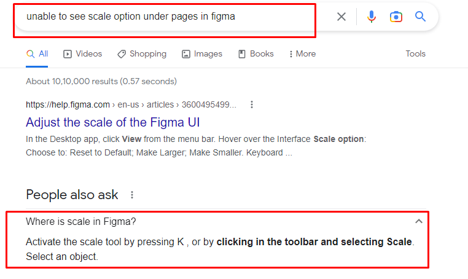

# Figma Fundamentals

## Frames, Layers andBasic Shapes | Make Video On Figma- Intro to tool

- **Frames** : Also referred to as an artboard.
- **Layer**: An object within a frame.
- **Group**: Multiple objects combined

## Type and Text | Make Video On Figma- Type and Text

## Typography and Best practice

## Grids and Constraints Make Video On Figma- Grids and Layout

- Responsive Design
- Ctrl + shift + 4 to toggle grids
- Grids organize the content on the page and create alignment and order.

## Creating grids for tablets and mobile

## Grid Systems

## Manipulating Elements - Boolean Opearations, Design with align Elements, Scaling an Object| Make video of Manipulating Elements

**1. Boolean Opearations**

- Union Selection
- Extract Selection
- Intersection Selection
- Subtract Selection

  **2. Design with align Elements**

- When working with multiple elements, it’s important to make sure they align precisely. You can achieve that by using the Design panel in the right sidebar.
- Proper alignment is important in a design. You can align objects by using the tools in the design panel in the right sidebar.

  **3. Scaling an Object- Resizing an Object**
  

Problems Faced:
[https://www.reddit.com/r/FigmaDesign/comments/gkynph/dont_see_boolean_tool/](https://www.reddit.com/r/FigmaDesign/comments/gkynph/dont_see_boolean_tool/)

[https://imgur.com/a/womCcia](https://imgur.com/a/womCcia)

[https://discourse.mcneel.com/t/boolean-union-failure-is-there-way-to-detect-where-solved-in-v6/48037](https://discourse.mcneel.com/t/boolean-union-failure-is-there-way-to-detect-where-solved-in-v6/48037)

## Working With Images
