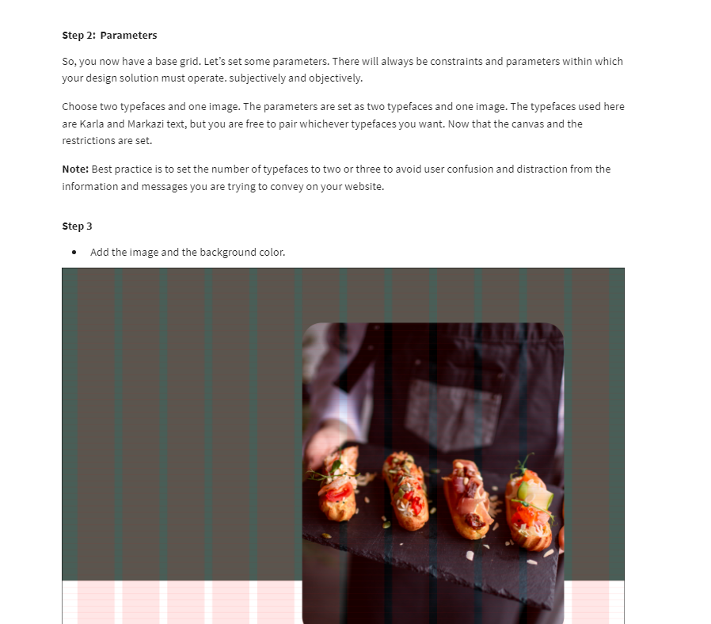
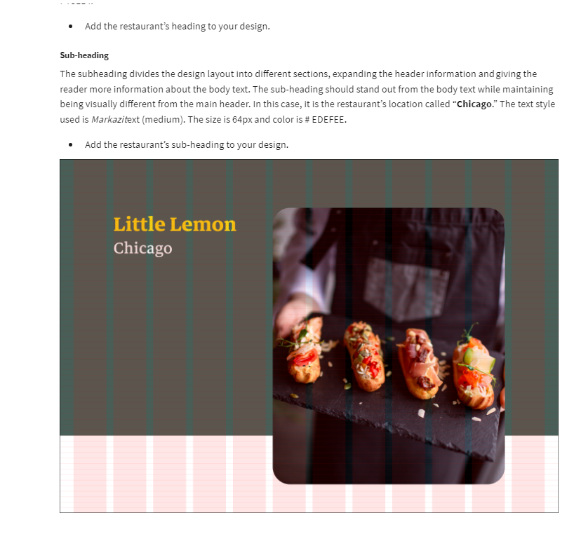

# Figma Fundamentals

## Frames, Layers andBasic Shapes | Make Video On Figma- Intro to tool

- **Frames** : Also referred to as an artboard.
- **Layer**: An object within a frame.
- **Group**: Multiple objects combined

## Type and Text | Make Video On Figma- Type and Text

## Typography and Best practice

## Grids and Constraints Make Video On Figma- Grids and Layout

- Responsive Design
- Ctrl + shift + 4 to toggle grids
- Grids organize the content on the page and create alignment and order.

## Creating grids for tablets and mobile

## Grid Systems

## Manipulating Elements - Boolean Opearations, Design with align Elements, Scaling an Object| Make video of Manipulating Elements

**1. Boolean Opearations**

- Union Selection
- Extract Selection
- Intersection Selection
- Subtract Selection

  **2. Design with align Elements**

- When working with multiple elements, it’s important to make sure they align precisely. You can achieve that by using the Design panel in the right sidebar.
- Proper alignment is important in a design. You can align objects by using the tools in the design panel in the right sidebar.

  **3. Scaling an Object- Resizing an Object**
  

Problems Faced:
[https://www.reddit.com/r/FigmaDesign/comments/gkynph/dont_see_boolean_tool/](https://www.reddit.com/r/FigmaDesign/comments/gkynph/dont_see_boolean_tool/)

[https://imgur.com/a/womCcia](https://imgur.com/a/womCcia)

[https://discourse.mcneel.com/t/boolean-union-failure-is-there-way-to-detect-where-solved-in-v6/48037](https://discourse.mcneel.com/t/boolean-union-failure-is-there-way-to-detect-where-solved-in-v6/48037)

## Working With Images |Make Video On Inserting Images, Masking Elements

- To create a mask in Figma, first you select the shape and the image. Then, you make sure that the image is on top of the shape. You can do that in the layers panel in the left sidebar.

## How to save and import Figma files

## Exercise: Design- Text Hierarchy and Grid

- Margins are the negative space between the outside column’s edge and the frame. The gutter is the negative space between columns.

- Every web page is made up of squares and rectangles. They are located within an encompassing grid layout.

- Baseline grids set the leading from one line of text to the next for consistency. These are easier to organize, create vertical rhythm, and are aesthetically pleasing. As you probably used at school, a sheet of ruled paper is an example of a baseline grid.

- The frame is a container where your design lives.

- Responsive design is an approach to web page creation that uses flexible layouts, removing the need to design layouts to suit every device.

## Additional Resources

The following resources are additional reading materials that introduce you to grid systems, how to use grids to improve hierarchy and 10 Principles for typography in UI design. These will add to the knowledge that you’ve gained in this lesson.

**Grids and constraints**

- [Video on grids and constraints](https://www.youtube.com/watch?v=BsR9dKfkNuA)

- [How to use grids to improve visual hierarchy](https://uxplanet.org/how-i-use-grids-to-improve-visual-hierarchy-18af5214e8a1)

**Typography**

- [10 Principles for Typography in UI Design: Typography in Design Systems](https://uxdesign.cc/10-principles-for-typography-usage-in-ui-design-a8f038f43ffd)

- [Typography and best practice](https://medium.com/eightshapes-llc/typography-in-design-systems-6ed771432f1e)

\*Consider reading Robert Bringhurst’s book called "The Elements of Typographic Style" if you want to learn more about typography.

# Wireframing
