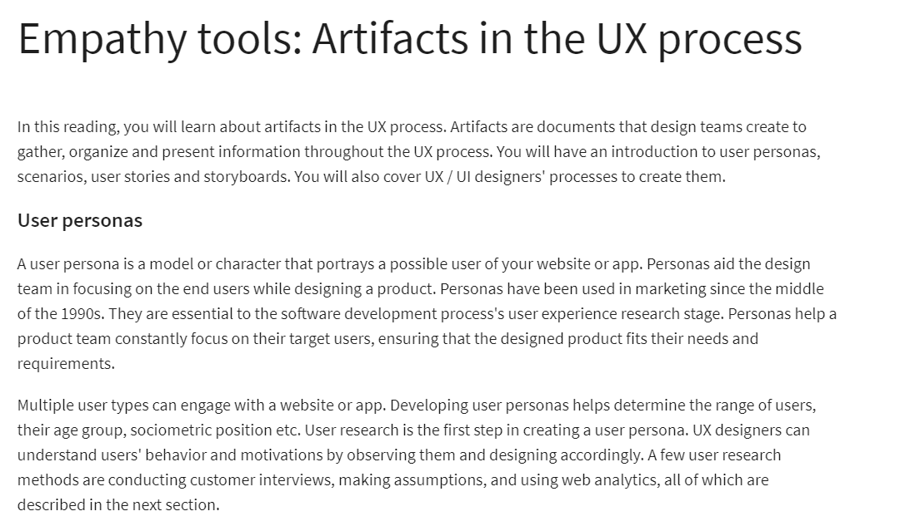
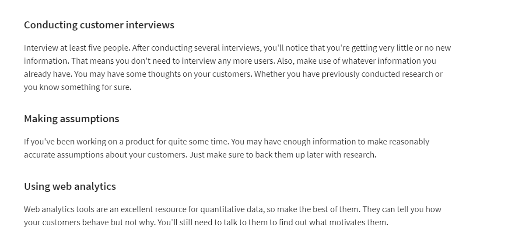
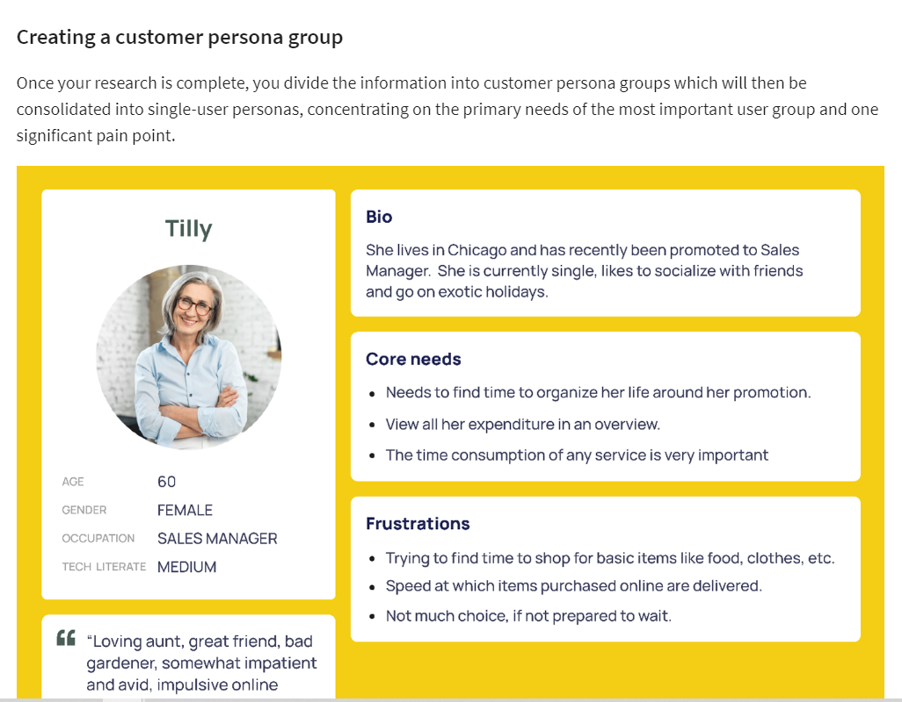
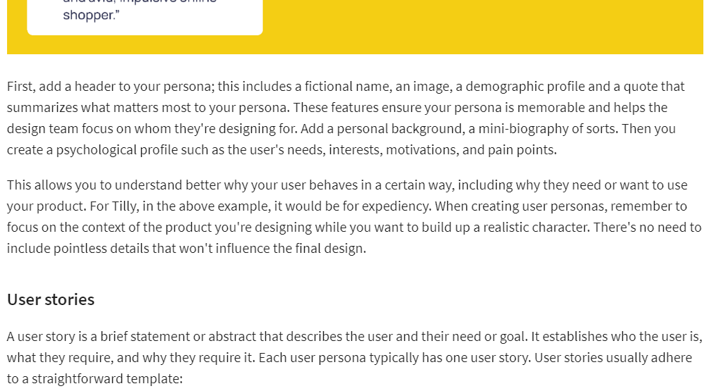
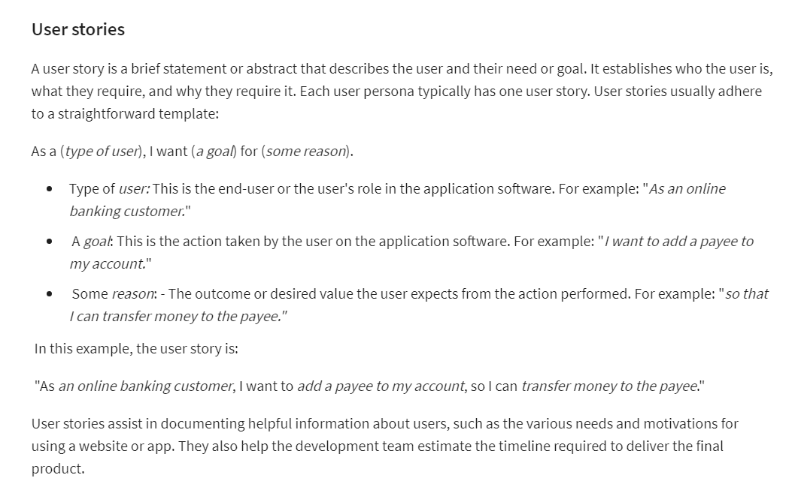
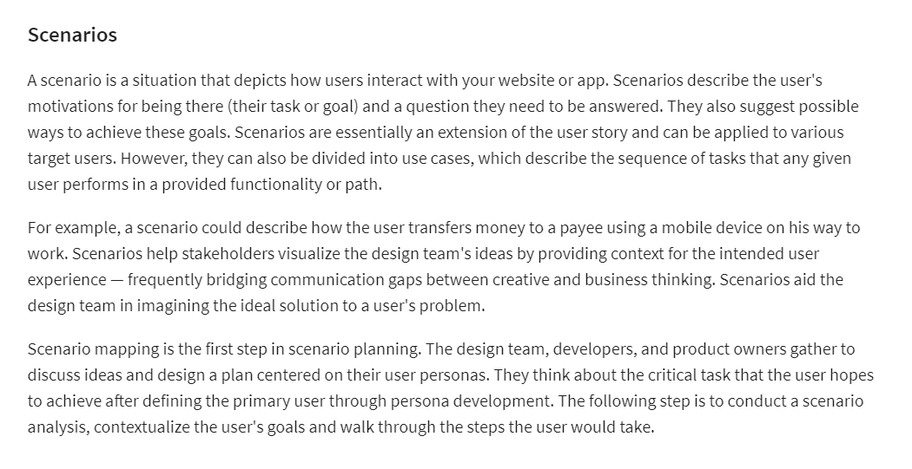
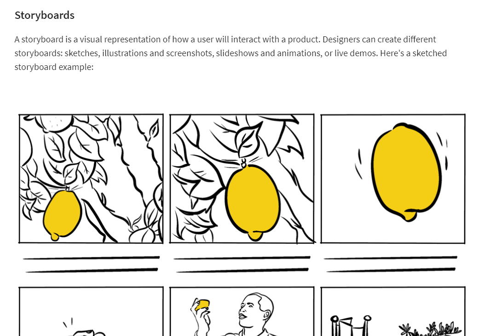
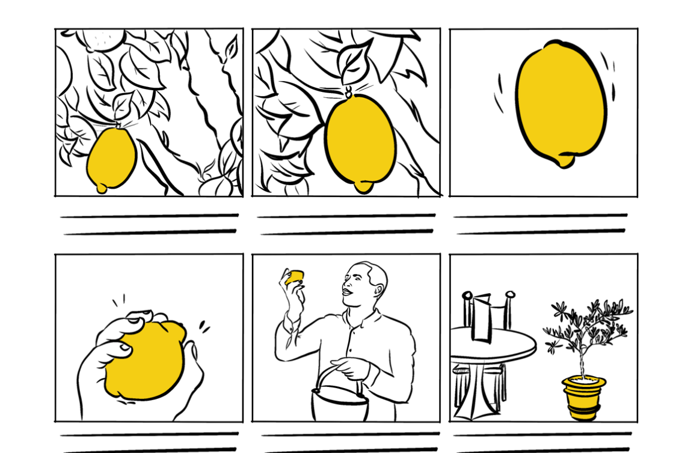
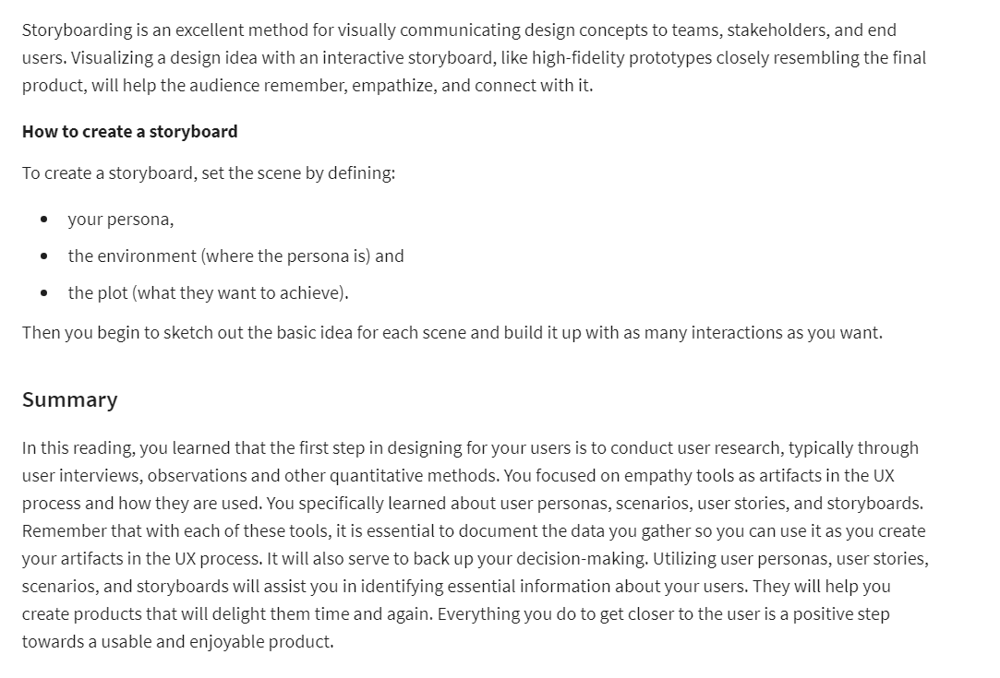

# Prinicples of UX/UI Design Syllabus

1. **Week 1: Introduction to UX/UI**
   In the first week, you will start with an overview of UX. You will explore the UX process, personas, scenarios and user stories. This leads you to an overview of what UI is. You will then set up your Figma account to start using Figma. But before progressing with using Figma, you will determine who your users are. This will lead right into the Little Lemon scenario, where you encounter Adrian and his brother Mario. They would like you to assist them with some UX / UI issues they are experiencing on their website. Your first step in resolving some of these issues is learning how to create a user persona.

- After completing the lesson items, you will be able to:

- Differentiate between UX and UI design.

- Define UX goals and explain its quality components.

- Explain the UX process.

- Evaluate interactive designs and create a modern user interface.

- Explain the concepts of the UI component of UX/UI and describe its history.

- Identify applications of UI.

- Recognize the importance of successful UI design.

- Create a Figma account.

- Identify how to use user interviews and observations.

- Explore a customer journey map.

- Identify tools in user research.

- Describe the role of user research tools in the empathize stage.

2. **Week 2: Evaluating Interactive Design**
   Next week, you will learn how to evaluate and practice interactive design methods. You will learn how to assess and improve your design and those of other designers. You will discover standard evaluation methodologies and use appropriate evaluation techniques to evaluate these designs. You will also learn to recognize best practices when designing forms and explore component design principles.

After completing the lesson items, you will be able to:

- Describe popular evaluation methodologies.

- Explain how the evaluation methodologies can be applied to improve your designs.

- Explain the importance of good form design.

- Implement best practices to strengthen form design.

- Evaluate a website.

- Use evaluation methods and interface guidelines.

- Evaluate your content and structure based on usability.

- Explain navigation best practices.

3. **Week 3: Applied Design Fundamentals**
   After familiarizing yourself with different methods to evaluate your design, you will explore what makes a user interface successful. You will also assess existing interfaces for design consistency and quality. You will work with frames, layers, shapes and images in Figma and describe the purpose of iterative design. Finally, you will create a wireframe in Figma.

After completing the lesson items, you will be able to:

- Explore how to use the layers panel in Figma.

- Identify how to duplicate, scale, group and align elements.

- Create a responsive grid system.

- Describe the concepts of wireframing.

- Design wireframes using Figma.

- Define usability testing.

- Describe the different types of usability testing.

4. **Week 4: Designing your UI**
   Next week, you will learn how to design your user interface (UI). You will also create, share and test your user interface using best practices. You will discover how to create high-fidelity user interface elements and be able to explain the importance of design systems. You will also apply advanced user interface techniques in Figma.

After completing the lesson items, you will be able to:

- Recognize how to use images, colors and shapes.

- Explain the role of images, colors and shapes in design.

- Name and explain what design systems and UI kits are.

- Differentiate between design systems and UI kits.

- Explain best practice design for design systems and UI kits.

- Explain what atomic design is.

- Create interactive prototypes using high-fidelity designs.

- Describe how these prototypes are animated and shared.

5. Week 5: Graded Assessment
   In the final week, you'll apply the skills you gained from the course to prepare a paper prototype wireframe for a new table reservation flow in Figma. You will then move on to complete the final graded assessment. After that, you will have the opportunity to reflect on the course content and review the learning path.

- After completing the project exercises, you will be able to:

- Create a paper prototype wireframe.

- Design a prototype for a new table reservation flow in Figma.

- Write a test script based on your wireframe and prototype.

# WEEK 1 : INTRODUCTION TO UX/UI DESIGN

## COURSE INTRODUCTION

- UI- User Interface
- UX- User Experience

1. UX is about asking the questions like:

- What are the customer's needs
- What's stopping them from achieving their goals
- How intuitive is the website to use?
- Can customers get from one section to another quickly and efficiently?

2. UI

- Gives info about :
- type, color, buttons, shapes, icons and images
- grouping and assembling
- helps users achieve their goals
- adhere to the brand

3. Difference UX and UI

- UX designer will research and identify needs and proposes solution via prototypes.
- UI Engineer will create logical and beautiful layouts with interactive flows with systemized designed library.

## WHAT IS UX?

--> **UX GOALS**

- UX includes everything related to all the interactions that a user has with a company, its services and products.

  **Usability** : Usability gauges how intuitive or easier product is to use. Jacob Nielsen's, a highly recognized professional in the field of usability, proposes that you can evaluate usability through five usability components. They are learnability, efficiency, memorability, errors, and satisfaction.

- Learnability
- Efficiency
- Memorability
- Errors
- Satisfaction

1. Learnability
   Let's start with learnability. When his customers are trying to order for delivery, Adrian wants the process to be easy to learn from the first time they do it.
2. Efficiency
   The second component is efficiency. What if users want to change their order? Is it easy to do, and can they do it quickly and efficiently?
3. Memorability
   Third, comes memorability. What if a user gets distracted? Is it easy to remember where they were when they return? How quickly can they find where they were?
4. Errors
   Next, go to usability needs to consider errors. What if a user makes a mistake? The design should provide solutions to these mistakes and address them before they happen.
5. Satisfaction
   Finally, comes satisfaction. Is the website pleasant or satisfying to use? Do users enjoy using it? Is it easy to use? Measuring user satisfaction is not an easy task. However, you know how it feels when you use an intuitive and well-designed product. It helps to think about the usability, quality components at all stages of your design. If you consider them from the outset, you will solve problems earlier in the process.

--> **Empathy tools: Artifacts in the UX process**

